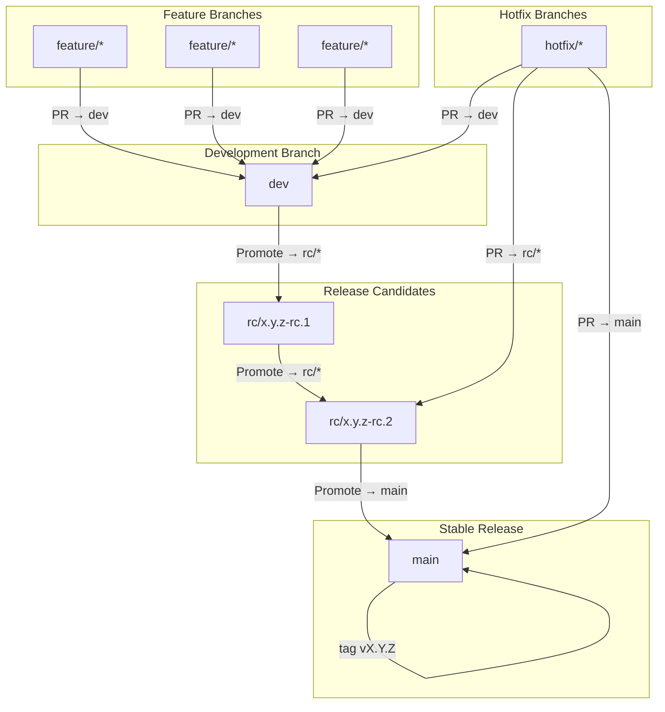

```mermaid
flowchart TD

    subgraph FeatureBranches[Feature Branches]
        F1[feature/*]
        F2[feature/*]
        F3[feature/*]
    end

    subgraph DevBranch[Development Branch]
        D[dev]
    end

    subgraph RCBranches[Release Candidates]
        RC1[rc/x.y.z-rc.1]
        RC2[rc/x.y.z-rc.2]
    end

    subgraph MainBranch[Stable Release]
        M[main]
    end

    subgraph HotfixBranches[Hotfix Branches]
        H1[hotfix/*]
    end

    %% Feature → Dev
    F1 -->|PR → dev| D
    F2 -->|PR → dev| D
    F3 -->|PR → dev| D

    %% Hotfix → Dev
    H1 -->|PR → dev| D

    %% Dev → RC (promotion)
    D -->|Promote → rc/*| RC1
    RC1 -->|Promote → rc/*| RC2

    %% RC → Main (promotion)
    RC2 -->|Promote → main| M

    %% Hotfix → Main
    H1 -->|PR → main| M

    %% Hotfix → RC
    H1 -->|PR → rc/*| RC2

    %% Releases
    M -->|tag vX.Y.Z| M

```
