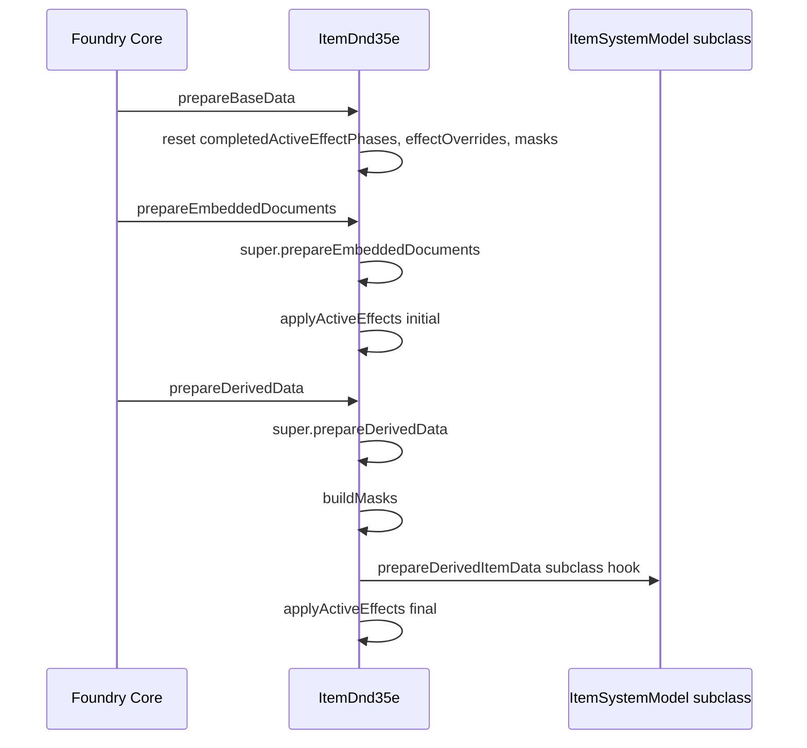
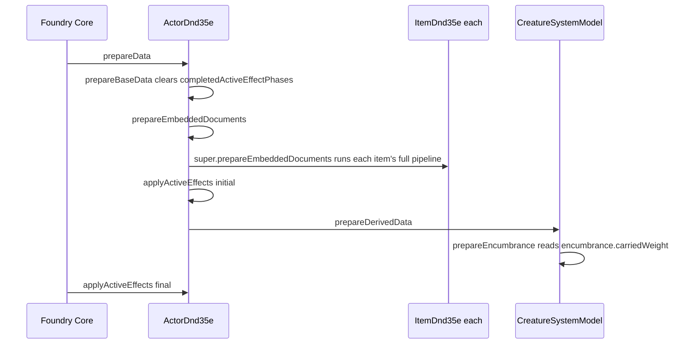

# Actor & Item Data Pipeline

> Companion to [Data Preparation Pipeline](data-preparation-pipeline.md) (conceptual overview) and
> [Active Effect Lifecycle](active-effect-lifecycle.md) (phase semantics). This document is a linear,
> factual trace of the data-preparation call chain for Actor and Item documents, from Foundry core through
> our own overrides, plus a catalog of every ActiveEffect in the system and the phase it targets.
>
> Foundry source citations below are verified against the real client source, not just `.d.mts` type
> declarations. `local.config.json`'s `foundryRootPath` points at a local Foundry install (e.g.
> `C:/Foundry/V14.359/App/resources/app/`) whose `client/`/`common/` directories contain the actual
> unminified `.mjs` source — read it directly for any future pipeline-ordering question.

---

## 1. Foundry's generic document prepare chain

Every `ClientDocument` (Actor, Item, ActiveEffect, etc.) follows the same top-level call order, defined once
in `client/documents/abstract/client-document.mjs:312` (`ClientDocumentMixin#prepareData`):

```
prepareData()
  1. system.prepareBaseData()       (if system is a TypeDataModel)
  2. this.prepareBaseData()
  3. this.prepareEmbeddedDocuments()
  4. system.prepareDerivedData()    (if system is a TypeDataModel)
  5. this.prepareDerivedData()
```

Both `Actor` and `Item` override steps 2/3/5 to hook in ActiveEffect application. The base
`prepareBaseData()`/`prepareEmbeddedDocuments()`/`prepareDerivedData()` methods on `ClientDocumentMixin`
itself do nothing beyond what subclasses add.

---

## 2. Foundry core's Actor overrides

Core `Actor` (`client/documents/actor.mjs`) adds ActiveEffect application around that generic chain:

| Method | Location | Body |
|---|---|---|
| `prepareBaseData()` | `actor.mjs:456` | Calls `_clearData()` |
| `_clearData()` | `actor.mjs:466` | Clears `overrides`, `tokenActiveEffectChanges`, `statuses`, `_completedActiveEffectPhases` |
| `prepareEmbeddedDocuments()` | `actor.mjs:476` | `super.prepareEmbeddedDocuments()` (preps every embedded Item fully), then `this.applyActiveEffects('initial')` |
| `prepareData()` | `actor.mjs:433` | `super.prepareData()` (runs the full chain from §1, including `prepareDerivedData()`), then `this.applyActiveEffects('final')` |
| `applyActiveEffects(phase)` | `actor.mjs:222` | Validates `phase`, collects non-disabled effect changes matching `change.phase === phase`, applies them |

So for an Actor, `'initial'`-phase changes apply inside `prepareEmbeddedDocuments()` — **before**
`prepareDerivedData()` runs — and `'final'`-phase changes apply in `prepareData()` **after**
`super.prepareData()` returns, i.e. **after** `prepareDerivedData()` has already completed.

Native `ActiveEffect.CHANGE_PHASES` (`common/constants.mjs:83`) is
`Object.freeze(["initial", "final"])` — there is no native `'core'` phase.

---

## 3. Our Item pipeline (`ItemDnd35e.mts`)

Items don't have a native `applyActiveEffects()` in core Foundry (only `Actor` does), so ours is a manual
port of the same logic (per the code comment on the method: *"Implementation from actor.mjs on version
14.354"*).



| Method | Location | What it does |
|---|---|---|
| `prepareBaseData()` | `ItemDnd35e.mts` | Resets `_completedActiveEffectPhases`, `effectOverrides`, `_masks` |
| `prepareEmbeddedDocuments()` | `ItemDnd35e.mts` | `super()` then `applyActiveEffects(INITIAL_EFFECT_CHANGE_PHASE)` |
| `prepareDerivedData()` | `ItemDnd35e.mts` | `super()`, `_buildMasks()`, `_prepareDerivedItemData()` (subclass hook, e.g. `Container` seeds `contentsWeight` here), then `applyActiveEffects(FINAL_EFFECT_CHANGE_PHASE)` |
| `_buildMasks()` | `ItemDnd35e.mts` | Reads MASK-type changes directly off `this.effects` (does **not** go through `applyActiveEffects`/phase filtering at all) and builds the `_masks` dictionary, highest-priority-per-key wins |
| `applyActiveEffects(phase)` | `ItemDnd35e.mts` | Filters `allApplicableEffects()` to item-targeted, non-MASK changes matching `phase`, sorts by priority, applies via `applyStackedActiveEffectChanges` |

---

## 4. Our Actor pipeline (`ActorDnd35e.mts` / `Creature.mts`)

`ActorDnd35e` does not override `prepareEmbeddedDocuments()` or `prepareDerivedData()` — those run exactly
as core defines them (§2). It overrides `prepareBaseData()` and `applyActiveEffects(phase)` only.



| Method | Location | What it does |
|---|---|---|
| `prepareBaseData()` | `ActorDnd35e.mts` | Resets `effectOverrides` (core's `_clearData()` still runs too, per §2) |
| `applyActiveEffects(phase)` | `ActorDnd35e.mts` | Validates phase, filters to actor-targeted AE changes, sorts by priority, applies via `applyStackedActiveEffectChanges` (shared engine with `ItemDnd35e`). Also merges in each owned item's `getContributedActorChanges(phase)` and the actor's own `getSelfContributedChanges(phase)` (see §6) before stacking. |
| `getSelfContributedChanges(phase)` | `ActorDnd35e.mts` (base returns `[]`) | Overridden by `Creature` to supply encumbrance-penalty changes (max Dex bonus, armor check penalty, land speed downgrade), computed fresh from the current `encumbrance.tier` on every call |
| `CreatureSystemModel.prepareDerivedData()` | `CreatureSystemModel.mts` (private `_prepareEncumbrance()`) | Reads `encumbrance.carriedWeight` (set during the `'initial'` phase above via `PhysicalItem.getContributedActorChanges()`) and computes `tier` |

---

## 5. Nested embedded-document writes and actor re-preparation

Item-owned ActiveEffects (Actor → Item → ActiveEffect) are two levels below the Actor. Per
`client/data/client-backend.mjs` (`ClientDatabaseBackend#handleCreateDocuments`/`#handleUpdateDocuments`/
`#handleDeleteDocuments`), every create/update/delete operation calls `operation.parent?.reset()` —
resetting only the **direct** parent of the changed document, then bubbles a `render()`-only event
(`_dispatchDescendantDocumentEvents`) up the rest of the ancestor chain.

For `item.createEmbeddedDocuments('ActiveEffect', [...])`, `operation.parent` is the Item, so only the Item
resets; the Actor only receives a `render()` call and does not re-run `prepareData()`. A direct top-level
update (`item.update(...)`, where the item is itself the changed document and `operation.parent` resolves
to the Actor) does correctly reset the Actor.

No system feature currently writes an AE nested two levels below the actor, so nothing needs the manual
reset workaround this scenario would require. Carried-weight and equipped-status contributions are plain
item-level `.update()` calls (Actor → Item, one level), which Foundry resets/re-renders the actor for
automatically.

---

## 6. Known system ActiveEffects, and live virtual changes with no backing AE, by phase/target

| Change source | Backing AE? | Change type | Phase | Target | Field(s) | Notes |
|---|---|---|---|---|---|---|
| Carried-item contribution (`PhysicalItem.getContributedActorChanges` / `_buildCarriedChanges`) | None - live | `add` | `initial` | `actor` | `system.encumbrance.carriedWeight`, `system.inventoryValue` | Recomputed unconditionally on every `prepareData()` pass from the item's current `isCarried`/`weight`/`quantity`/`price`/`containerUuid` state; nothing persisted, no document to create/toggle/delete |
| Encumbrance penalty (`Creature.getSelfContributedChanges` / `_buildEncumberedChanges`) | None - live | `downgrade` | `final` | `actor` | `system.encumbrance.maxDexBonus`, `system.abilities.dex.mod`, `system.encumbrance.armorCheckPenalty`, `system.speed.land` | Only returned when `tier > 0`; reads the tier computed earlier in the same pass by `CreatureSystemModel._prepareEncumbrance()` |
| Equipped-status contribution (`EquippableItem.getContributedActorChanges` / `_buildEquippedChanges`) | None - live | `add` | n/a (currently empty) | `actor` | none yet | Placeholder for moving actions to the actor on equip; recomputed live like carried-item contribution |
| Containment contribution (`buildContainmentChanges`) | Real AE, on the container item | `add` | `final` | `item` | `system.contentsWeight`, `system.contentsValue` | Applied on the container item (not the actor); rolls weight/value up through nested containers |
| Secret mask, GM-authored (`SecretMasks.vue` UI default) | Real AE | `mask` (`SYSTEM_CHANGE_TYPE.MASK`) | `initial` (UI default, unenforced) | `item` (UI default) | arbitrary field path | `_buildMasks()` reads MASK changes directly and never filters by `phase`, so this value is not functionally checked |
| Secret mask, player-edit (`playerEditSecret.mts`) | Real AE | `mask` | `core` | `actor` or `item` (host-dependent) | arbitrary field path | Same as above — `phase: 'core'` never passes through `applyActiveEffects`'s native phase validation because `_buildMasks()` bypasses it entirely |
| Generic user-created change (`EffectChangesList.vue` UI default) | Real AE | `add` | `initial` | `item` | user-chosen key | Default values pre-filled when a GM adds a new change row on an effect sheet |

---

## Integration Points

| System | Integration |
|---|---|
| [Data Preparation Pipeline](data-preparation-pipeline.md) | Conceptual 3-stage model this doc traces to actual call sites |
| [Active Effect Lifecycle](active-effect-lifecycle.md) | Phase semantics (`core`/`initial`/`final`) |
| [Bonus Stacking](bonus-stacking.md) | `applyStackedActiveEffectChanges` is the shared engine both `ActorDnd35e` and `ItemDnd35e` call into |
| `ActorDnd35e.mts` | Actor-level phase application |
| `ItemDnd35e.mts` | Item-level phase application, `_buildMasks()` |
| `PhysicalItem.mts` | Live carried-weight contribution (`getContributedActorChanges()`/`_buildCarriedChanges()`), no backing AE |
| `EquippableItem.mts` | Live equipped-status contribution (`getContributedActorChanges()`/`_buildEquippedChanges()`), no backing AE |
| `Creature.mts` / `CreatureSystemModel.mts` | Encumbrance tier (`CreatureSystemModel._prepareEncumbrance()`) + live penalty changes (`Creature.getSelfContributedChanges()`/`_buildEncumberedChanges()`), no backing AE |
| `containmentAe.mts` / `buildContainmentChanges.mts` | Container contribution AE |
| `playerEditSecret.mts` / `SecretMasks.vue` | Secret MASK changes |
| Real Foundry source (`local.config.json` → `foundryRootPath`) | Authoritative source for any future pipeline-ordering question |
