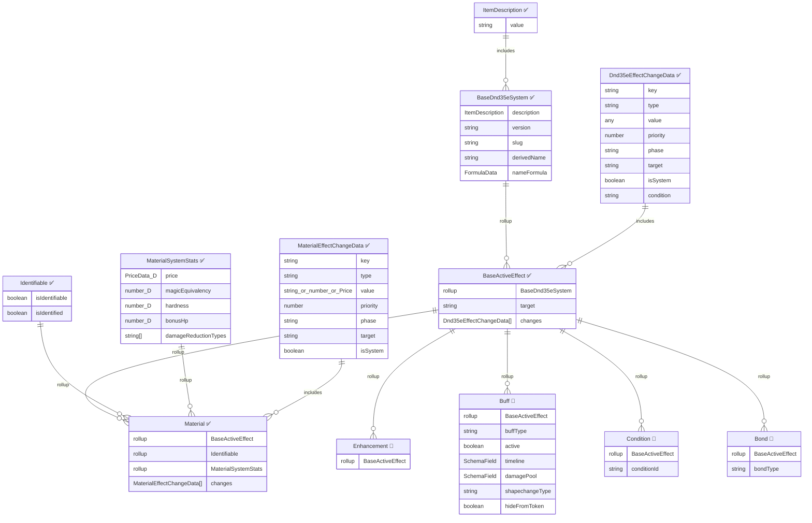

# 📘 Active Effect Architecture Reference (Work in Progress)

A unified reference for all active effect components, compositions, and concrete effect types in the system.

> **Legend**: ✅ = Implemented &nbsp;|&nbsp; 🔲 = Planned (not yet in codebase)
>
> Fields decorated with field metadata are marked with `🔷`.
>
> **Note**: Material was migrated from an Item type to an Active Effect type.

---

## Two-Axis Design

AE architecture has two orthogonal axes:

1. **Domain Type** (Foundry `type` field → TypeDataModel): What the AE represents and what extra schema fields it carries.
2. **Change Timing** (`phase` field on each change): When each change is applied. A single AE can have changes in multiple phases.

---

## Phase System

Foundry V14 provides two built-in phases (`initial`, `final`) and supports system-registered custom phases via `CONFIG.ActiveEffect.phases`. We register `core` and three action phases.

### Prep-Cycle Phases (run every data preparation)

```
prepareBaseData()
  → prepareEmbeddedDocuments():
      Document.prepareEmbeddedDocuments()   // base embedded doc setup
      applyActiveEffects("core")            // BAB, saves, racial mods, HD, size, speed
      _computeCoreStats()                   // totals from core: ability mods, BAB total, save bases
      applyActiveEffects("initial")         // equipment, feats, buffs, conditions
  → prepareDerivedData()                    // AC, attack totals, skill totals, carry capacity
  → applyActiveEffects("final")            // late-binding overrides, post-derived adjustments
```

| Phase | When | What Goes Here | Examples |
|-------|------|----------------|----------|
| `core` | Before `_computeCoreStats()` | Character identity — race & class grants. Things that ARE the character's base stats. | Racial +2 DEX, BAB from class, base saves from class, HD, size, speed, natural armor |
| `initial` | After `_computeCoreStats()`, before `prepareDerivedData()` | Modifications that need core stats resolved. | Equipment bonuses, feat passives, buff stat mods (Bull's Strength), conditions, enhancement bonuses, class abilities based on calculated stats |
| `final` | After `prepareDerivedData()` | Late-binding overrides, anything needing fully derived values. Rare. | Post-derived adjustments |

**Why `_computeCoreStats()` between core and initial:** `initial`-phase changes can reference values derived from `core` changes. A class ability that adds CON modifier to something needs the racial +2 CON applied AND the mod recomputed before `initial` runs. Without the computation step, both phases pile into `overrides` with no ordering benefit.

**Implementation — override `prepareEmbeddedDocuments`:**
```typescript
// ActorDnd35e
prepareEmbeddedDocuments() {
  // Call Document base directly (skip Actor's auto-call to "initial")
  foundry.abstract.DataModel.prototype.prepareEmbeddedDocuments.call(this);
  this.applyActiveEffects("core");
  this._computeCoreStats();  // ability mods, BAB total, save bases
  this.applyActiveEffects("initial");
}
```

### Action Phases (on-demand, NOT during prep cycle)

Action phases are registered in `CONFIG.ActiveEffect.phases` so they appear in the change editor dropdown, but `Actor.applyActiveEffects()` is **never** called for them during prep. The action system collects these changes directly when needed:

```typescript
// In action execution (not applyActiveEffects — that's prep only)
const attackChanges = [...actor.allApplicableEffects()]
  .flatMap(e => e.system.changes.filter(c => c.phase === 'action.attack'));
// Run through stacking engine with action context (target, conditions, etc.)
```

| Phase | When Collected | What Goes Here | Examples |
|-------|---------------|----------------|----------|
| `action.attack` | On attack/damage execution | Per-attack conditionals | Flanking +2, Power Attack trade-off, Weapon Focus +1, ammo effects, alignment damage |
| `action.save` | On saving throw | Per-save conditionals | Great Fortitude +2, +4 vs fear, poison save bonuses |
| `action.check` | On skill/ability check | Per-check conditionals | Skill Focus +3, circumstance bonuses |

Action-phase changes carry a `condition` field — a formula familiar string that resolves to boolean with the roll context. The action system evaluates the condition, surfaces applicable changes in the PreRollDialog, and applies them through the same stacking engine.

### Phase Registration

```typescript
// In system init
CONFIG.ActiveEffect.phases = {
  core:              { label: "DND35E.AE.Phase.Core",          hint: "DND35E.AE.Phase.CoreHint" },
  // "initial" and "final" are Foundry built-ins, auto-registered
  "action.attack":   { label: "DND35E.AE.Phase.ActionAttack",  hint: "DND35E.AE.Phase.ActionAttackHint" },
  "action.save":     { label: "DND35E.AE.Phase.ActionSave",    hint: "DND35E.AE.Phase.ActionSaveHint" },
  "action.check":    { label: "DND35E.AE.Phase.ActionCheck",   hint: "DND35E.AE.Phase.ActionCheckHint" },
};
```

---

## Type Hierarchy (Domain Axis)

Each type has its own `TypeDataModel` registered via `CONFIG.ActiveEffect.dataModels`. Foundry's `hasTypeData: true` supports this natively.

> **`baseTypeAllowed: false`** — All AEs must have a registered type. Vanilla Foundry `base` type is not allowed. This ensures every AE goes through our system model and participates in stacking. Post-release, this will be set to `true` with migration/transform logic for external module compatibility.

```
Dnd35eActiveEffectSystemModel (extends ActiveEffectTypeDataModel)
│  Common fields: sourceType
│  Override: changes uses Dnd35eEffectChangeData schema
│
├── GeneralSystemModel                        🔲 Planned (Phase 2)
│     No additional fields beyond base schema
│     Default type for user-created AEs, racial mods, feat passives, equipment bonuses
│     transfer: computed (any actor-targeted change → true)
│     phases used: any
│
├── MaterialSystemModel                       ✅ Implemented
│     materialSubtype, material stat fields, DR bypass
│     transfer: always false (item-only)
│     phases used: core, initial
│
├── EnhancementSystemModel                    🔲 Planned (Phase 23)
│     enhancementBonus, price equivalent
│     transfer: configurable
│     phases used: core, initial
│
├── BuffSystemModel                           🔲 Planned (Phase 20)
│     buffType, active, timeline, damagePool, shapechange, hideFromToken
│     transfer: n/a (lives directly on actor)
│     phases used: initial (stat mods), action.* (conditional bonuses)
│
├── ConditionSystemModel                      🔲 Planned (Phase 13/20)
│     conditionId, condition tracks
│     isSuppressed override for condition-specific logic
│     phases used: initial
│
├── BondSystemModel                           🔲 Planned (Advanced Actors)
│     bondType: 'container'|'familiar'|'animalCompanion'|'mount'|'summon'|'cohort'|'commanded'
│     relationship reference: Foundry native `origin` field (not a custom field)
│     transfer: false (lives on the target document)
│     phases used: initial (for stat scaling changes), or none (pure relationship)
│
└── (base) — Foundry built-in. DISABLED (`baseTypeAllowed: false`). Post-release: re-enable with transform logic for external module AEs.
```

---

## ER Diagram



## Effect Type Registry

| Type | Document Class | System Model | Sheet | Status |
|------|---------------|-------------|-------|--------|
| `general` | `DnD35eActiveEffect` | `GeneralSystemModel` | Default AE sheet | 🔲 Planned (Phase 2) |
| `material` | `Material` | `MaterialSystemModel` | `MaterialSheet` | ✅ Implemented |
| `enhancement` | — | `EnhancementSystemModel` | — | 🔲 Planned (Phase 23) |
| `buff` | — | `BuffSystemModel` | — | 🔲 Planned (Phase 20) |
| `condition` | — | `ConditionSystemModel` | — | 🔲 Planned (Phase 13/20) |
| `bond` | — | `BondSystemModel` | — | 🔲 Planned (Advanced Actors) |
| `base` | — | — | — | ❌ Disabled (`baseTypeAllowed: false`). Post-release: re-enable with transform/migration for external module compat. |

## Composition Chain

```
Foundry ActiveEffect
  └─ DnD35eActiveEffect (base class, custom transfer/hasItemChanges)
       └─ Dnd35eDocumentMixin (doc-level helpers)
            └─ IdentifiableDocumentMixin (isIdentifiable/isIdentified)
                 ├─ General (default type, no extra fields)
                 └─ Material (transfer=false, isTemporary=false)
```

## Change Target System

Each `Dnd35eEffectChangeData` has a `target` field that determines where the change applies:

| Target | Description |
|--------|-------------|
| `item` | Change applies to the parent item's system data |
| `actor` | Change transfers to and applies on the owning actor |

- `DnD35eActiveEffect.transfer` is computed: `true` if any change targets `actor`
- `Material.transfer` is overridden to always `false` (materials only modify items)

## Effect Change Data

```typescript
interface Dnd35eEffectChangeData extends foundry.EffectChangeData {
  target: 'Actor' | 'Item';      // Where the change applies
  isSystem: boolean;              // Generated by system code vs user-configured
  phase: 'core' | 'initial' | 'final' | 'action.attack' | 'action.save' | 'action.check';
  bonusType?: BonusType;          // Stacking resolution (Phase 2)
  condition?: string;             // Formula familiar → boolean (action phases only)
}
```

**Condition field**: For action-phase changes only. A formula familiar string that resolves to boolean with the roll context. Examples: `"#target.size > #self.size"`, `"#self.isFlanking"`, `"#action.weapon.type == 'longsword'"`. The action system evaluates the condition and includes the change only if truthy.

## Bond AE Design

Bond AEs establish relationships between documents. The AE *is* the relationship — creating it creates the bond, removing it severs it.

**Relationship reference**: Uses Foundry's native `origin` field (UUID of the creating document). No custom `bondedTo` field needed — `origin` is maintained by Foundry across document moves (compendium → world → actor).

**BondSystemModel schema**:
```
BondSystemModel extends Dnd35eActiveEffectSystemModel
├── bondType: 'container'|'familiar'|'animalCompanion'|'mount'|'summon'|'cohort'|'commanded'
└── (changes[] for stat modifications — companion scaling, container weight reduction, etc.)
```

**Reverse lookup**: Query documents for bond AEs where `origin` matches the source's UUID. ("What items are in this container?" → find items with bond AE where `origin` = container UUID.)

**Lifecycle**: Hook-driven. Container creates bond AE on item when item enters; removes it when item leaves. Class feature creates companion bond AE on companion actor when feature is granted; removes it when feature is removed.

## Context Notes

Context notes are **text only** — not AE changes. They are descriptive strings on items/feats displayed in relevant contexts (roll cards, tooltips). Separate from the AE system.

## System-Generated Changes (Material)

`MaterialSystemModel.buildChanges()` auto-generates effect changes from the material's stats fields. These are marked with `isSystem: true` and rebuilt in `prepareDerivedData()`. User-added changes (`isSystem: false`) are preserved alongside them.

| Stat Field | Change Key | Change Type | Target |
|-----------|-----------|-------------|--------|
| `price` | `system.price` | `add` | `item` |
| `magicEquivalency` | `system.magicEquivalency` | `upgrade` | `item` |
| `hardness` | `system.hardness` | `add` | `item` |
| `bonusHp` | `system.hp.max` | `add` | `item` |
| `damageReductionTypes` (each) | `system.damageReductionTypes` | `add` | `item` |
