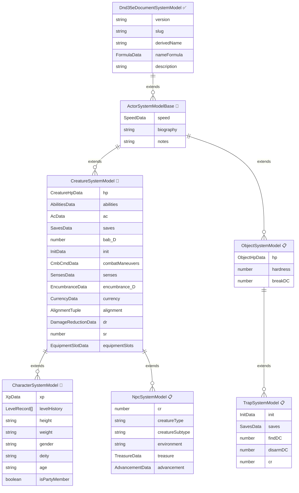

# 📘 Actor Architecture Reference (Work in Progress)

A unified reference for all actor type compositions, inheritance chains, and field assignments.

> **Legend**: ✅ = Implemented &nbsp;|&nbsp; 🔲 = Planned (assigned to a phase) &nbsp;|&nbsp; 📋 = Deferred (no phase yet) &nbsp;|&nbsp; ⛔ = Removed (D35E field not carried forward)
>
> **Phase column** shows which phase introduces the field. "—" means it's carried from D35E but has no consumer yet.

---

## Inheritance Hierarchy

---

## Architecture Decisions

### Shell-Now, Derive-Later
Fields with reasonable defaults or partial derivations are included in Phase 5 even when their full derivation depends on later phases. AC starts as `10 + DEX mod`. Saves start as `0 + ability mod`. BAB starts at `0`. Each later phase enriches the derivation without changing the field shape.

### Racial HD via Progression Component
The SRD makes no mechanical distinction between monsters and NPCs. A dragon's racial HD provides BAB, saves, skill points — just like a class. Both classes and monstrous races embed a **Progression** component (HD, BAB, saves, skills, grant schedule). The level-up system aggregates all progressions from all owned items. Standard races (Human, Elf) have no progression. Monstrous races (Dragon) embed a progression that appears alongside class progressions in the level-up UI. See Phase 11 and Phase 12 for details.

### NPC Covers Monsters
`npc` is a single type for all non-player creatures: goblins, dragons, NPCs with class levels, mindless undead. The "monster stat block" vs "NPC character sheet" is a presentation concern (different sheet layouts), not a type distinction.

### Bond via AE, Not Stored Fields
The legacy `master` field is replaced by the **Bond Pattern**: a non-transfer AE applied to the bonded creature with `bondType`, `bondedTo` (UUID), and `sharedInitiative` in its changes. Bond AEs are appropriate because the relationship changes frequently (summons dismissed, mounts changed). The `bond.*` fields in the ER diagram below are kept as a backwards-compatibility note; they will NOT be stored fields on the schema. Instead, bond data is read from the Bond AE on the actor. Reverse lookup (what is bonded TO me) uses AE queries. Deferred to Advanced Actors phase.

### Level History as Source of Truth
Characters track an immutable ledger of every level gained: `system.levelHistory: LevelRecord[]`. Each record captures the progression source, HP breakdown (die size — `null` for levels with HD overridden to 0, roll result, CON mod at that time), skill point breakdown (base, INT mod at that time, allocated skills — all 0 for HD-overridden levels), ability score increase choice (at total HD milestones 4/8/12/16/20), grants created, and choices made. The level history is the source of truth for auditing. BAB, saves, and total HP are ***derived*** from the history + progression schedules in `prepareDerivedData()` — never stored. `totalHD` = count of entries where `hp.dieSize !== null` (excludes levels where the progression's `hdOverride` set HD to 0). Soft validation: edits that break downstream prerequisites produce derived warnings but are not prevented. See Phase 12 for edit rules.

### Identifiable Architecture (Secrets)
Identifiable redesign has landed via the Secret AE architecture. Player-visible masking is driven by Secret AE `_masks` plus `ViewMode` (`edit` / `play` / `true`), with per-field visibility/editability handled by `flags.dnd35e.fieldOverrides`. This remains a cross-cutting concern across items, actors, and active effects, but the core model is established.

---

## Field Tables

### ActorSystemModelBase

All actors inherit these fields.

| Field | Type | Phase | Stored/Derived | D35E Source | Notes |
|-------|------|-------|----------------|-------------|-------|
| `speed.land.base` | number | 6 🔲 | Stored | `attributes.speed.land.base` | Default 30 (human). Race modifies via AE |
| `speed.land.total` | number | 6 🔲 | Derived | `attributes.speed.land.total` | base + modifiers (armor, encumbrance, effects) |
| `speed.climb.base` | number | 6 🔲 | Stored | `attributes.speed.climb.base` | Default 0 |
| `speed.climb.total` | number | 6 🔲 | Derived | `attributes.speed.climb.total` | |
| `speed.swim.base` | number | 6 🔲 | Stored | `attributes.speed.swim.base` | Default 0 |
| `speed.swim.total` | number | 6 🔲 | Derived | `attributes.speed.swim.total` | |
| `speed.burrow.base` | number | 6 🔲 | Stored | `attributes.speed.burrow.base` | Default 0 |
| `speed.burrow.total` | number | 6 🔲 | Derived | `attributes.speed.burrow.total` | |
| `speed.fly.base` | number | 6 🔲 | Stored | `attributes.speed.fly.base` | Default 0 |
| `speed.fly.total` | number | 6 🔲 | Derived | `attributes.speed.fly.total` | |
| `speed.fly.maneuverability` | string | 6 🔲 | Stored | `attributes.speed.fly.maneuverability` | "clumsy"\|"poor"\|"average"\|"good"\|"perfect" |
| `biography` | string | 6 🔲 | Stored | `details.biography.value` | Rich text |
| `notes` | string | 6 🔲 | Stored | `details.notes.value` | Rich text |
| `bond` | — | ⛔ | — | `master` | Replaced by Bond Pattern AE on the bonded creature. Not a stored field. |
| `bond.actorId` | — | ⛔ | — | `master.id` | Bond AE carries `bondedTo` UUID in its changes |
| `bond.bondType` | — | ⛔ | — | — | Bond AE carries `bondType` in its changes |
| `bond.sharedInitiative` | — | ⛔ | — | — | Bond AE carries `sharedInitiative` in its changes |
| `bonds` | ActorDnd35e[] | 📋 | Derived | — | Reverse lookup via Bond AE query |

#### D35E `common` fields NOT carried to ActorBase

| D35E Field | Reason |
|-----------|--------|
| `shapechangeImg` | Specialized — defer to conditions/polymorph |
| `tokenImg` | Foundry handles token images natively |
| `companionUuid/PublicId/...` | Replaced by `bond` mixin on ActorSystemModelBase |
| `resources` | Empty in template, unclear purpose |
| `noLightOverride` | Token/scene concern, not system data |
| `noTokenOverride` | Token/scene concern |
| `noBuffDisplay` | UI preference, becomes a setting |
| `lockEditingByPlayers` | Foundry permissions handle this |
| `showCardSheet` | UI preference |
| `showSpellcastingSheet` | UI preference |
| `staticBonus` | Replaced by AE stacking system |

---

### CreatureSystemModel

Shared by Character and NPC.

#### Abilities

| Field | Type | Phase | Stored/Derived | D35E Source | Notes |
|-------|------|-------|----------------|-------------|-------|
| `abilities.str.base` | number | 6 🔲 | Stored | `abilities.str.value` | Raw score |
| `abilities.str.mod` | number | 6 🔲 | Derived | `abilities.str.mod` | `floor((base - 10) / 2)` |
| `abilities.dex.base` | number | 6 🔲 | Stored | `abilities.dex.value` | |
| `abilities.dex.mod` | number | 6 🔲 | Derived | `abilities.dex.mod` | |
| `abilities.con.base` | number | 6 🔲 | Stored | `abilities.con.value` | |
| `abilities.con.mod` | number | 6 🔲 | Derived | `abilities.con.mod` | |
| `abilities.int.base` | number | 6 🔲 | Stored | `abilities.int.value` | |
| `abilities.int.mod` | number | 6 🔲 | Derived | `abilities.int.mod` | |
| `abilities.wis.base` | number | 6 🔲 | Stored | `abilities.wis.value` | |
| `abilities.wis.mod` | number | 6 🔲 | Derived | `abilities.wis.mod` | |
| `abilities.cha.base` | number | 6 🔲 | Stored | `abilities.cha.value` | |
| `abilities.cha.mod` | number | 6 🔲 | Derived | `abilities.cha.mod` | |

##### Ability fields deferred to later phases

| Field | Phase | D35E Source | Notes |
|-------|-------|-------------|-------|
| `abilities.*.damage` | 20 (Conditions Full) | `abilities.*.damage` | Ability damage (temporary) |
| `abilities.*.drain` | 20 | `abilities.*.drain` | Ability drain (permanent) |
| `abilities.*.penalty` | 20 | `abilities.*.penalty` | Ability penalty (stacks) |
| `abilities.*.userPenalty` | 20 | `abilities.*.userPenalty` | Manual penalty override |
| `abilities.*.checkMod` | Skills | `abilities.*.checkMod` | Ability check modifier |
| ~~`abilities.str.carryBonus`~~ | — | — | Moved to `encumbrance.carryBonus` |
| ~~`abilities.str.carryMultiplier`~~ | — | — | Moved to `encumbrance.carryMultiplier` |

#### Hit Points (Creature)

| Field | Type | Phase | Stored/Derived | D35E Source | Notes |
|-------|------|-------|----------------|-------------|-------|
| `hp.value` | number | 6 🔲 | Stored | `attributes.hp.value` | Current HP |
| `hp.max` | number | 6 🔲 | Derived | `attributes.hp.max` | Placeholder: `1 × HD + CON mod`. Classes replace |
| `hp.temp` | number | 6 🔲 | Stored | `attributes.hp.temp` | Temporary HP |
| `hp.nonlethal` | number | 6 🔲 | Stored | `attributes.hp.nonlethal` | Nonlethal damage taken |
| `hp.min` | number | 6 🔲 | Stored | `attributes.hp.min` | Death threshold (default -10) |

##### HP fields deferred

| Field | Phase | D35E Source | Notes |
|-------|-------|-------------|-------|
| `hp.base` | 12 (Classes) | `attributes.hp.base` | Sum of HD rolls |
| `wounds.value/min` | — | `attributes.wounds` | Variant wound/vigor system |
| `vigor.value/min/temp` | — | `attributes.vigor` | Variant wound/vigor system |

#### Armor Class

| Field | Type | Phase | Stored/Derived | D35E Source | Notes |
|-------|------|-------|----------------|-------------|-------|
| `defense.armorClass` | number | 6 🔲 | Derived | `defense.armorClass.total` | `10 + DEX mod`. +armor/shield (Ph15), +size (Ph11), +deflect/dodge etc. |
| `defense.touchAC` | number | 6 🔲 | Derived | `attributes.defense.touchAC.total` | `10 + DEX mod`. No armor/shield |
| `defense.flatFootedAC` | number | 6 🔲 | Derived | `attributes.defense.flatFootedAC.total` | `10`. No DEX bonus |
| `ac.naturalArmor` | number | 11 (Races) 🔲 | Stored | `attributes.naturalAC` | Race/monster natural armor |

##### AC fields deferred

| Field | Phase | D35E Source | Notes |
|-------|-------|-------------|-------|
| `ac.naturalArmorTotal` | 11+ | `attributes.naturalACTotal` | Natural + enhancement |
| `attributes.concealment` | 20 | `attributes.concealment` | Miss chance |
| `attributes.fortification` | 15 | `attributes.fortification` | Crit negation % |
| `attributes.maxDexBonus` | 15 | `attributes.maxDexBonus` | Armor max DEX |
| `attributes.acp` | 15 | `attributes.acp` | Armor check penalty |

#### Saving Throws

| Field | Type | Phase | Stored/Derived | D35E Source | Notes |
|-------|------|-------|----------------|-------------|-------|
| `saves.fort.base` | number | 6 🔲 | Stored | `attributes.savingThrows.fort.base` | 0 until Classes provides progression |
| `saves.fort.total` | number | 6 🔲 | Derived | `attributes.savingThrows.fort.total` | `base + CON mod` |
| `saves.fort.ability` | string | 6 🔲 | Stored | — | Default "con". Configurable for edge cases |
| `saves.ref.base` | number | 6 🔲 | Stored | `attributes.savingThrows.ref.base` | |
| `saves.ref.total` | number | 6 🔲 | Derived | `attributes.savingThrows.ref.total` | `base + DEX mod` |
| `saves.ref.ability` | string | 6 🔲 | Stored | — | Default "dex" |
| `saves.will.base` | number | 6 🔲 | Stored | `attributes.savingThrows.will.base` | |
| `saves.will.total` | number | 6 🔲 | Derived | `attributes.savingThrows.will.total` | `base + WIS mod` |
| `saves.will.ability` | string | 6 🔲 | Stored | — | Default "wis" |

#### Combat Stats

| Field | Type | Phase | Stored/Derived | D35E Source | Notes |
|-------|------|-------|----------------|-------------|-------|
| `bab` | number | 6 🔲 | Derived | `attributes.bab.total` | 0 until Classes provides progression |
| `init.bonus` | number | 6 🔲 | Stored | `attributes.init.bonus` | Misc initiative bonus (feats, items) |
| `init.total` | number | 6 🔲 | Derived | `attributes.init.total` | `DEX mod + bonus` |
| `cmb` | number | 8 (Actions) 🔲 | Derived | `attributes.cmb.total` | `BAB + STR mod + size mod` |
| `cmd` | number | 8 🔲 | Derived | `attributes.cmd.total` | `10 + BAB + STR mod + DEX mod + size mod` |

##### Combat fields deferred

| Field | Phase | D35E Source | Notes |
|-------|-------|-------------|-------|
| `attack.general/melee/ranged` | 8 | `attributes.attack.*` | Attack modifiers |
| `damage.general/weapon/spell` | 8 | `attributes.damage.*` | Damage modifiers |
| `sneakAttackDiceTotal` | 10 (Feats) | `attributes.sneakAttackDiceTotal` | Class feature |
| `maxAoO` | 8 | `attributes.maxAoO` | Attacks of opportunity |

#### Defenses

| Field | Type | Phase | Stored/Derived | D35E Source | Notes |
|-------|------|-------|----------------|-------------|-------|
| `sr` | number | 6 🔲 | Stored | `attributes.sr.total` | Spell resistance. 0 default |
| `dr` | array | 6 🔲 | Stored | `attributes.damageReduction` | DR entries (value, types) |
| `energyResistance` | array | 📋 | Stored | `attributes.energyResistance` | Defer — no consumer yet |

#### Senses

| Field | Type | Phase | Stored/Derived | D35E Source | Notes |
|-------|------|-------|----------------|-------------|-------|
| `senses.darkvision` | number | 📋 | Stored | `attributes.senses.darkvision` | Range in feet. Defer to Races/Token |
| `senses.blindsight` | number | 📋 | Stored | `attributes.senses.blindsight` | |
| `senses.tremorsense` | number | 📋 | Stored | `attributes.senses.tremorsense` | |
| `senses.truesight` | number | 📋 | Stored | `attributes.senses.truesight` | |
| `senses.lowLight` | boolean | 📋 | Stored | `attributes.senses.lowLight` | |

#### Encumbrance

| Field | Type | Phase | Stored/Derived | D35E Source | Notes |
|-------|------|-------|----------------|-------------|-------|
| `encumbrance.carriedWeight` | number | 6 🔲 | Derived | `attributes.encumbrance.carriedWeight` | Sum of inventory weight |
| `encumbrance.light` | number | 6 🔲 | Derived | `attributes.encumbrance.levels.light` | STR-based threshold |
| `encumbrance.medium` | number | 6 🔲 | Derived | `attributes.encumbrance.levels.medium` | |
| `encumbrance.heavy` | number | 6 🔲 | Derived | `attributes.encumbrance.levels.heavy` | |
| `encumbrance.carry` | number | 6 🔲 | Derived | `attributes.encumbrance.levels.carry` | Max lift overhead |
| `encumbrance.drag` | number | 6 🔲 | Derived | `attributes.encumbrance.levels.drag` | Max push/drag |
| `encumbrance.level` | number | 6 🔲 | Derived | `attributes.encumbrance.level` | 0=light, 1=medium, 2=heavy, 3=over |
| `encumbrance.carryBonus` | number | 6 🔲 | Stored | `abilities.str.carryBonus` | Flat bonus to base carrying capacity. Default 0. AE-targetable (e.g., Carrying feats). |
| `encumbrance.carryMultiplier` | number | 6 🔲 | Stored | `abilities.str.carryMultiplier` | Capacity multiplier. Default 1.0 (medium, bipedal). AEs set to 2.0 (Large), 1.5 (quadruped). |

#### Currency & Vault

| Field | Type | Phase | Stored/Derived | D35E Source | Notes |
|-------|------|-------|----------------|-------------|-------|
| `currency` | CurrencyField | 6 🔲 | Stored | `currency.*` | Currency carried on person. Uses world-settings coins (same infrastructure as item prices via `CurrencyData.getCurrencyConfig()`). Contributes to encumbrance unless the "ignore currency weight" world setting is on. |

> **One built-in currency field per actor.** Future vaults are named container items (Beta Phase 1+) each carrying their own `CurrencyField`. Debt tracking is on the post-release wishlist.
>
> `CurrencyField` (renamed from `PriceField` in Phase 6 pre-story) supports all world-configured currencies, AE add/subtract/multiply change modes, consolidation, and GP-equivalent snapshot.

##### Currency fields removed

| D35E Field | Disposition | Notes |
|-----------|-------------|-------|
| `currency.pp/gp/sp/cp` | ⛔ Removed | Replaced by `currency: CurrencyField` (world-settings currencies) |
| `altCurrency` | ⛔ Removed | Replaced by named vault container items (Beta Phase 1+) |
| `customCurrency` | ⛔ Removed | Replaced by world-settings currency configuration (`CurrencyData.getCurrencyConfig()`) |

#### Equipment Slots

| Field | Type | Phase | Stored/Derived | D35E Source | Notes |
|-------|------|-------|----------------|-------------|-------|
| `slotCapacities` | Record | 15 (Equipment) 🔲 | Stored | `slotCapacities` | Per-slot item limits. Uses existing `equipmentSlots.mts` |

> Equipment slot tracking lives on the items (`equippedSlotIds`), not on the actor. The actor just defines slot capacities.
> Weapon slots (mainhand/offhand) need to be added — see Group C decisions in Phase 5 doc.

#### Other Creature Fields

| Field | Type | Phase | Stored/Derived | D35E Source | Notes |
|-------|------|-------|----------------|-------------|-------|
| `alignment` | [MoralAxis\|null, ChaosAxis\|null] | 6 🔲 | Stored | `details.alignment` | Strongly-typed tuple. `MoralAxis = 'good'\|'neutral'\|'evil'`. `ChaosAxis = 'lawful'\|'neutral'\|'chaotic'`. Null for unaligned/any-alignment creatures (some monster stat blocks). Maps to the 3×3 grid; null renders as "—". Agreed with D35E creator. |
| `size` | string | 6 🔲 | Stored | `traits.size` | Default "medium". Race modifies. Uses `SIZES` constant |
| `level` | number | 6 🔲 | Derived | `details.level.value` | Placeholder = 1. Classes replace with sum of class levels |

##### Creature fields deferred

| Field | Phase | D35E Source | Notes |
|-------|-------|-------------|-------|
| `skills` | Skills phase | `skills.*` | Not on model at all until Skills phase. 36+ skills |
| `customSkills` | Skills phase | `customSkills` | User-defined skills |
| `conditions` | 13/20 | `attributes.conditions.*` | 26 condition flags. Not on model until Conditions phase |
| `spells/spellbooks` | 16 (Spells) | `attributes.spells.spellbooks.*` | Class-driven, not actor-common. Added by class items |
| `cards/decks` | 30 (Cards) | `attributes.cards.decks.*` | Post-release |
| `turnUndeadHdTotal` | 10+ | `attributes.turnUndeadHdTotal` | Class feature |
| `turnUndeadUses*` | 10+ | `attributes.turnUndeadUses*` | Class feature |
| `prestigeCl` | 16+ | `attributes.prestigeCl` | Prestige class caster levels |
| `arcaneSpellFailure` | 16 | `attributes.arcaneSpellFailure` | From armor, affects spells |
| `psionicFocus` | 24 (Psionics) | `attributes.psionicFocus` | |
| `powerPointsTotal` | 24 | `attributes.powerPointsTotal` | |
| `traits.languages` | 11 (Races) | `traits.languages` | Known languages |
| `traits.di/dv/ci` | 20 | `traits.di/dv/ci` | Damage immunities/vulnerabilities/condition immunities |
| `traits.dr/incorporeal/eres/cres` | 20 | `traits.*` | Damage reduction (alt format), energy resist |
| `quadruped` | 11 | `attributes.quadruped` | Affects carrying capacity |
| `energyDrain` | 20 | `attributes.energyDrain` | Negative levels |

##### Creature fields removed

| D35E Field | Reason |
|-----------|--------|
| `attributes.prof` | D&D 5e concept, not 3.5e |
| `attributes.hd.base/max._deprecated` | Deprecated in D35E already |
| `noSkillSynergy` | Setting, not system data |
| `bonusSkillRankFormula` | Skill phase will handle differently |
| `minionClassLevels/minionDistance` | Replaced by bond system |

---

### CharacterSystemModel

Extends Creature. Character-specific fields.

| Field | Type | Phase | Stored/Derived | D35E Source | Notes |
|-------|------|-------|----------------|-------------|-------|
| `xp.value` | number | 6 🔲 | Stored | `details.xp.value` | Current XP. Cosmetic in milestone mode. |
| `xp.max` | number | 12 🔲 | Derived | `details.xp.max` | XP to next level. Derived from GM's XP table in XP mode; 0 in milestone mode. |
| `height` | string | 6 🔲 | Stored | `details.height` | Description field |
| `weight` | string | 6 🔲 | Stored | `details.weight` | Description field (character weight, not inventory) |
| `gender` | string | 6 🔲 | Stored | `details.gender` | |
| `deity` | string | 6 🔲 | Stored | `details.deity` | |
| `age` | string | 6 🔲 | Stored | `details.age` | |
| `isPartyMember` | boolean | 6 🔲 | Stored | `isPartyMember` | Show in party tracker |

#### Level History (Character)

| Field | Type | Phase | Stored/Derived | D35E Source | Notes |
|-------|------|-------|----------------|-------------|-------|
| `levelHistory` | LevelRecord[] | 12 🔲 | Stored | `details.levelUpData` | Immutable ledger. One record per level gained. |
| `levelHistory[].progressionId` | string | 12 🔲 | Stored | — | ID of the class/race item providing this level |
| `levelHistory[].hp.dieSize` | number\|null | 12 🔲 | Stored | — | HD size (d4-d12) from progression. `null` if this level's HD is overridden to 0 (monster class progression) |
| `levelHistory[].hp.rollResult` | number\|null | 12 🔲 | Stored | — | null until player clicks Roll (or null permanently for HD-overridden levels). No auto-roll |
| `levelHistory[].hp.conMod` | number | 12 🔲 | Stored | — | **Permanent** CON mod snapshot at time of leveling (excludes enhancement/temporary). 0 for HD-overridden levels |
| `levelHistory[].skillPoints.base` | number | 12 🔲 | Stored | — | Skill points from class. 0 for HD-overridden levels |
| `levelHistory[].skillPoints.intMod` | number | 12 🔲 | Stored | — | **Permanent** INT mod snapshot at time of leveling (excludes enhancement/temporary). 0 for HD-overridden levels |
| `levelHistory[].skillPoints.allocated` | Record | 12 🔲 | Stored | — | `{skillId: pointsSpent}` map |
| `levelHistory[].abilityIncrease` | string\|null | 12 🔲 | Stored | — | Ability key at levels 4/8/12/16/20, null otherwise |
| `levelHistory[].grants` | string[] | 12 🔲 | Stored | — | IDs of items granted at this level |
| `levelHistory[].choices` | Record | 12 🔲 | Stored | — | Choices made for choice-type grants |

#### Character Derived Fields (from Level History)

| Field | Type | Phase | Stored/Derived | Notes |
|-------|------|-------|----------------|-------|
| `derived.totalLevel` | number | 12 🔲 | Derived | `levelHistory.length` — all levels including HD-overridden levels |
| `derived.totalHD` | number | 12 🔲 | Derived | Count of `levelHistory` entries where `hp.dieSize !== null`. Excludes levels where the progression's `hdOverride` set HD to 0. Governs feat/ability score milestones. For standard PCs, equals `totalLevel`. |
| `derived.levelWarnings` | ValidationWarning[] | 12 🔲 | Derived | Prerequisite violations, invalid levels, broken grants |

#### Central Prerequisite Registry (Derived)

During `prepareDerivedData()`, the actor scans all owned items that have a `prerequisites` array (feats, prestige classes) and collects them into a central registry. This provides a single validation point for prerequisite checking — easier to query, extend, and display.

| Field | Type | Phase | Stored/Derived | Notes |
|-------|------|-------|----------------|-------|
| `derived.prerequisiteRegistry` | PrerequisiteRecord[] | 14 🔲 | Derived | One entry per owned item with prerequisites |
| `derived.prerequisiteRegistry[].itemId` | string | 14 🔲 | Derived | ID of the item being validated |
| `derived.prerequisiteRegistry[].itemName` | string | 14 🔲 | Derived | Display name of the item |
| `derived.prerequisiteRegistry[].itemType` | string | 14 🔲 | Derived | "feat" \| "class" (prestige) |
| `derived.prerequisiteRegistry[].prerequisites` | EvaluatedPrereq[] | 14 🔲 | Derived | Each prerequisite with met/unmet status |
| `derived.prerequisiteRegistry[].prerequisites[].type` | string | 14 🔲 | Derived | Extensible — types grow organically as item data is migrated from D35E (e.g., "bab", "feat", "skill", "custom"). Not a fixed enum. |
| `derived.prerequisiteRegistry[].prerequisites[].label` | string | 14 🔲 | Derived | Human-readable: "BAB +6", "STR 13", "Power Attack" |
| `derived.prerequisiteRegistry[].prerequisites[].met` | boolean | 14 🔲 | Derived | Whether the actor currently satisfies this prerequisite |
| `derived.prerequisiteRegistry[].allMet` | boolean | 14 🔲 | Derived | Shortcut: all prereqs met for this item |

The registry is rebuilt every `prepareDerivedData()` cycle — never persisted. Items without prerequisites are not included. The `derived.levelWarnings` array references unmet prerequisites from this registry to produce actionable diagnostic messages.

**Extensibility**: post-release modules can register custom prerequisite types (e.g., "race", "alignment", "spellKnown") by extending the evaluator lookup. The registry scans all owned items generically — no item-type-specific code in the scan loop.

##### Character fields deferred

| Field | Phase | D35E Source | Notes |
|-------|-------|-------------|-------|
| `traits.weaponProf` | 12 | `traits.weaponProf` | From class/feat |
| `traits.armorProf` | 12 | `traits.armorProf` | From class/feat |
| `displayNonRTSkills` | Skills | `displayNonRTSkills` | UI preference for skill display |
| `jumpSkillAdjust` | Skills | `jumpSkillAdjust` | Synergy toggle |
| `noVisionOverride` | 6 (Token) | `noVisionOverride` | Token vision |

---

### NpcSystemModel

Extends Creature. Covers **all** non-player creatures: goblins, dragons, NPCs with class levels, mindless undead — including named villain NPCs and anonymous merchants.

> **SRD analysis confirms**: No mechanical distinction between "NPC" and "monster" in D&D 3.5e. Both use identical ability scores, saves, BAB, feats, and skills. CR, Environment, Treasure, and Advancement are informational extras that monsters happen to have, not a schema boundary. A merchant NPC is just a human with Commoner/Expert class levels. A dragon is a creature with racial HD progression. Both advance through the same `Progression` component. **One type, two sheet presentations.**
>
> Lair/legendary actions do not exist in D&D 3.5e (5e only). No schema reason to split.

| Field | Type | Phase | Stored/Derived | D35E Source | Notes |
|-------|------|-------|----------------|-------------|-------|
| `cr` | number | 📋 | Stored | `details.cr` | Challenge rating |
| `totalCr` | number | 📋 | Derived | `details.totalCr` | CR with class level adjustments |
| `creatureType` | string | 📋 | Stored | `details.type` | Aberration, dragon, humanoid, etc. |
| `environment` | string | 📋 | Stored | `details.environment` | Typical habitat |
| `xp.value` | number | 📋 | Derived | `details.xp.value` | XP reward (derived from CR) |
| `treasure` | TreasureData | 📋 | Stored | `details.treasure` | Treasure generation percentiles |
| `advancement` | AdvancementData | 📋 | Stored | `details.advancement` | HD advancement ranges |

##### NPC fields deferred

| Field | Phase | Notes |
|-------|-------|-------|
| `noVisionOverride` | 6 | Token vision |

##### NPC fields removed

| D35E Field | Reason |
|-----------|--------|
| `master` | Replaced by bond mixin on ActorSystemModelBase |
| `attributes.spellLevel` | Unclear purpose, not standard 3.5e |

---

### Companion Relationship (Bond AE Pattern)

Companion is **not a separate actor type**. Any actor (Character, NPC, Object) can be bonded to a controller via a **Bond AE** — a non-transfer active effect applied to the bonded creature carrying `bondType`, `bondedTo` (UUID), and `sharedInitiative` in its changes. No schema field on any model. Reverse lookup (what is bonded TO me) uses AE queries.

> Bond fields shown as `⛔` in the `ActorSystemModelBase` field table are confirmed **not stored** — they exist as a D35E migration note only.

> **No schema stub needed**: Bond design is deferred entirely. When the Bond/Companion feature is implemented, it reads/writes Bond AEs, not schema fields. The actor's actual type never changes.

---

### ObjectSystemModel

Extends ActorBase. Destructible inanimate objects: doors, walls, terrain, statues.

| Field | Type | Phase | Stored/Derived | D35E Source | Notes |
|-------|------|-------|----------------|-------------|-------|
| `hp.value` | number | 📋 | Stored | `attributes.hp.value` | Current HP |
| `hp.max` | number | 📋 | Stored | `attributes.hp.max` | Max HP (no temp, no nonlethal) |
| `hardness` | number | 📋 | Stored | `attributes.hardness.total` | Subtracted from damage before HP loss |
| `breakDC` | number | 📋 | Stored | `details.breakDC.total` | Strength check to break |
| `size` | string | 📋 | Stored | `traits.size` | Affects HP, AC |

##### Object fields removed

| D35E Field | Reason |
|-----------|--------|
| `master` | No bond on objects — animated objects become companions |
| `attributes.spellLevel` | Not applicable |
| `details.environment` | Not meaningful for objects |
| `traits.tokensize: "none"` | Objects can have tokens |

---

### TrapSystemModel

Extends Object. Traps are objects that fight back.

| Field | Type | Phase | Stored/Derived | D35E Source | Notes |
|-------|------|-------|----------------|-------------|-------|
| `init.bonus` | number | 📋 | Stored | — | For traps in initiative order |
| `init.total` | number | 📋 | Derived | — | Usually flat value, no DEX |
| `findDC` | number | 📋 | Stored | `details.findDC` | Search DC to discover |
| `disarmDC` | number | 📋 | Stored | `details.disarmDC` | Disable Device DC |
| `cr` | number | 📋 | Stored | `details.cr` | Challenge rating |
| `saves.fort`/`ref`/`will` | number | 📋 | Stored | — | Magic traps may have saves |

---

## Future Types (Post-Release, Notes Only)

### Vehicle
Extends Object. Wagons, ships, siege engines. Has crew capacity, passenger capacity, propulsion type. May integrate with existing community modules. Decision: build or integrate. Deferred to super-advanced actors.

### IntelligentItem
Special case. Needs INT/WIS/CHA but not STR/DEX/CON. Has ego score, communication modes, special purpose. Abilities stay on Creature for now; intelligent items handle their own mental ability subset when the time comes.

---

## Cross-Cutting Concerns

### Identifiable (Current State)
Current architecture uses Secret AEs for masking and `ViewMode` for presentation:
- `play` mode shows player-visible masked/effective values
- `true` mode shows unmasked effective values (GM-only)
- Field-level visibility/editability uses override metadata + `flags.dnd35e.fieldOverrides`
- System behavior is shared across items, actors, and active effects

Future enhancements (if desired):
- Partial identification tiers beyond masked/unmasked
- Additional UX refinements based on community feedback

### Skills
Not on any actor model until the dedicated Skills phase (after Phase 12 Classes). Basic skill checks (d20 + ability mod) introduced in Phase 8 as an example of actor-owned actions. Full skill system (ranks, class skills, synergies, 36+ skills) in Skills phase.

### Conditions
Not on any actor model until Conditions phase. The Effects tab shows Active Effects from day one. Condition toggle UI added when the Conditions phase arrives.

### Spellcasting
Not on any actor model — added per-class by class items. D35E put 4 full spellbook definitions in `common` — we do NOT repeat this.
