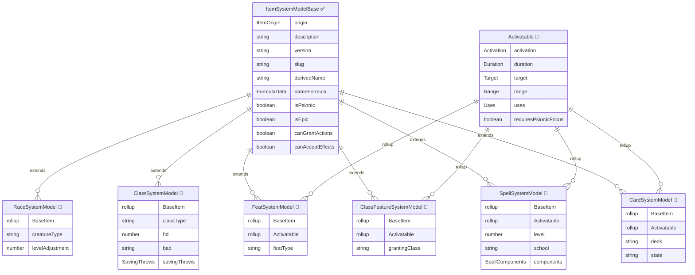

# 📘 Metaphysical Item PropertyMap (Work in Progress)

Abstract game features represented as items — classes, races, feats, class features, spells, buffs, cards.

> **Legend**: ✅ = Implemented | 🔲 = Planned | 📋 = Deferred | ⛔ = Removed
>
> **"Metaphysical"** = not a physical object. These are rules constructs, character features, and ability definitions that live on an actor as owned items but have no weight, price, or physical form.

---

## Inheritance Hierarchy



---

## Concrete Types

### Race 🔲
Defines racial traits, size, speeds, racial HD, and ability modifiers. Applied to an actor as a single owned item.

`canGrantActions: true` (racial abilities like breath weapon) | `canAcceptEffects: false`

> **Display name**: User wants option to relabel as "Ancestry" or "Bloodline" via system setting. Default label = "Race" (RAW). Internal type key stays `race` regardless.

| Field | Type | Phase | Stored/Derived | D35E Source | Notes |
|-------|------|-------|----------------|-------------|-------|
| `creatureType` | string | 11 🔲 | Stored | `creatureType` | "humanoid"\|"aberration"\|"dragon"\|... |
| `levelAdjustment` | number | 11 🔲 | Stored | `la` | LA for ECL calculation |
| `subTypes` | string[] | 11 🔲 | Stored | `subTypes` | e.g. ["elf", "human"] for half-elf |
| `naturalArmor` | number | 11 🔲 | Stored | — | Natural armor bonus from race |
| `size` | string | 11 🔲 | Stored | — | Default size for this race |
| `speeds` | SpeedOverrides | 11 🔲 | Stored | — | Racial base speeds (land, fly, swim, etc.) |

> Racial ability modifiers, bonus feats, skill bonuses, etc. are applied via Active Effects granted by the race item. The race item itself stores only the "identity" fields above.
>
> Racial HD are handled as a pseudo-class item auto-granted by the race. See Phase 12 coordination.

### CharacterClass 🔲
Defines a character class with HD, BAB progression, save progression, spellcasting, and granted features.

`canGrantActions: false` (classes grant ClassFeatures which have actions) | `canAcceptEffects: false`

> ⚠️ **Needs dedicated deep-dive conversation.** Class is the most complex item type. It drives level-up, BAB, saves, HP, skill points, spellcasting, and feature grants. The conversation will significantly affect this PropertyMap and the Race interaction.

| Field | Type | Phase | Stored/Derived | D35E Source | Notes |
|-------|------|-------|----------------|-------------|-------|
| `classType` | string | 12 🔲 | Stored | `classType` | "base"\|"prestige"\|"racial"\|"template"\|"npc" |
| `levels` | number | 12 🔲 | Stored | `levels` | Current levels in this class |
| `maxLevel` | number | 12 🔲 | Stored | `maxLevel` | Max levels (20 for base, 10 for prestige, etc.) |
| `hd` | number | 12 🔲 | Stored | `hd` | Hit die size (4, 6, 8, 10, 12) |
| `bab` | string | 12 🔲 | Stored | `bab` | "high"\|"med"\|"low" |
| `skillsPerLevel` | number | 12 🔲 | Stored | `skillsPerLevel` | Base skill points per level |
| `savingThrows.fort` | string | 12 🔲 | Stored | `savingThrows.fort` | "high"\|"low" |
| `savingThrows.ref` | string | 12 🔲 | Stored | `savingThrows.ref` | "high"\|"low" |
| `savingThrows.will` | string | 12 🔲 | Stored | `savingThrows.will` | "high"\|"low" |
| `classSkills` | object | 12 🔲 | Stored | `classSkills` | Map of skill keys → boolean |
| `spellcastingType` | string | 16 🔲 | Stored | `spellcastingType` | "none"\|"arcane"\|"divine"\|"psionic" |
| `spellcastingAbility` | string | 16 🔲 | Stored | `spellcastingAbility` | "int"\|"wis"\|"cha" |
| `spellcastingSpontaneous` | boolean | 16 🔲 | Stored | `spellcastingSpontaneus` | Prepared vs spontaneous |

> Many D35E class fields are deferred or will change shape after the class conversation. The table above captures the core progression fields only.

### Feat 🔲
Feats: selectable character options with prerequisites that must be "purchased" at level-up or with bonus feat slots.

`canGrantActions: true` (Power Attack, Cleave, etc.) | `canAcceptEffects: ⏳ Deferred` (metamagic feat interaction with spells TBD)

**Feats are distinct from Class Features** — a feat has prerequisites the player must meet and is chosen by the player. A class feature is granted automatically by a class at a specific level. They share the Activatable component but differ in acquisition and display.

| Field | Type | Phase | Stored/Derived | D35E Source | Notes |
|-------|------|-------|----------------|-------------|-------|
| `featType` | string | 14 🔲 | Stored | `featType` | "general"\|"combat"\|"metamagic"\|"itemCreation"\|... |
| `abilityType` | string | 14 🔲 | Stored | `abilityType` | "ex"\|"su"\|"sp"\|"" |
| `prerequisites` | PrerequisiteData[] | 14 🔲 | Stored | — | NEW: structured prereqs (BAB, ability score, feat, etc.) |
| `associations.classes` | string[] | 14 🔲 | Stored | `associations.classes` | Classes that can grant this as bonus feat |
| `crOffset` | string | 14 🔲 | Stored | `crOffset` | CR adjustment formula |

> D35E's `metamagic`, `spellSpecialization`, and `links` sub-objects on Feat are mostly metamagic-feat-specific. These will be evaluated during the metamagic deep-dive (Phase 16) — they may become an AE pattern rather than stored feat fields.

### ClassFeature 🔲
Features granted by a class at specific levels. NOT player-chosen — automatically added during level-up.

`canGrantActions: true` (Turn Undead, Smite Evil, etc.) | `canAcceptEffects: false`

**NEW type** — D35E uses `feat` with `featType` for both feats and class features. Splitting them gives us:
- Clearer UI separation (feats section vs class features section on sheet)
- No prerequisite system needed — granted by class, period
- Class can also grant bonus feats (actual Feat items), but class features are always ClassFeature items
- Simpler data model (no prerequisites, no metamagic)

| Field | Type | Phase | Stored/Derived | D35E Source | Notes |
|-------|------|-------|----------------|-------------|-------|
| `grantingClass` | string | 14 🔲 | Stored | `associations.classes` | Class that grants this feature |
| `grantedAtLevel` | number | 14 🔲 | Stored | — | Level at which this is granted |
| `abilityType` | string | 14 🔲 | Stored | `abilityType` | "ex"\|"su"\|"sp"\|"" |
| *(Activatable fields for usable features like Smite Evil, Turn Undead)* | | | | | |

### Spell 🔲
Spells and psionic powers.

`canGrantActions: true` (cast the spell) | `canAcceptEffects: ⏳ Deferred` (metamagic AE application TBD)

| Field | Type | Phase | Stored/Derived | D35E Source | Notes |
|-------|------|-------|----------------|-------------|-------|
| `level` | number | 16 🔲 | Stored | `level` | Spell level (0-9) |
| `school` | string | 16 🔲 | Stored | `school` | "abjuration"\|"conjuration"\|... |
| `subschool` | string | 16 🔲 | Stored | `subschool` | e.g. "healing", "creation" |
| `learnedAt.class` | string[] | 16 🔲 | Stored | `learnedAt.class` | Class spell lists this appears on |
| `learnedAt.domain` | string[] | 16 🔲 | Stored | `learnedAt.domain` | Domain lists |
| `components.verbal` | boolean | 16 🔲 | Stored | `components.verbal` | V component |
| `components.somatic` | boolean | 16 🔲 | Stored | `components.somatic` | S component |
| `components.material` | boolean | 16 🔲 | Stored | `components.material` | M component |
| `components.focus` | boolean | 16 🔲 | Stored | `components.focus` | F component |
| `components.divineFocus` | number | 16 🔲 | Stored | `components.divineFocus` | DF (0=none, 1=DF, 2=M/DF) |
| `materials.value` | string | 16 🔲 | Stored | `materials.value` | Material component description |
| `materials.focus` | string | 16 🔲 | Stored | `materials.focus` | Focus description |
| `castTime` | string | 16 🔲 | Stored | `castTime` | "1 standard action", "1 round", etc. |
| `sr` | boolean | 16 🔲 | Stored | `sr` | Subject to spell resistance? |
| `spellbook` | string | 16 🔲 | Stored | `spellbook` | Which spellbook this is prepared in |
| `preparation.preparedAmount` | number | 16 🔲 | Stored | `preparation.preparedAmount` | Times prepared |
| `preparation.maxAmount` | number | 16 🔲 | Stored | `preparation.maxAmount` | Max preparations |
| `atWill` | boolean | 16 🔲 | Stored | `atWill` | Unlimited uses? |
| `clOffset` | number | 16 🔲 | Stored | `clOffset` | Caster level offset |
| `shortDescription` | string | 16 🔲 | Stored | `shortDescription` | One-line summary for lists |
| `spellDuration` | string | 16 🔲 | Stored | `spellDuration` | Duration text |
| `spellEffect` | string | 16 🔲 | Stored | `spellEffect` | Effect text |
| `spellArea` | string | 16 🔲 | Stored | `spellArea` | Area text |
| `isPower` | boolean | 16 🔲 | Stored | `isPower` | Psionic power? |
| `powerPointsCost` | number | 16 🔲 | Stored | `powerPointsCost` | PP cost for psionics |

### Buff ⛔ Removed as Item Type
Buff is **no longer an item type** in dnd35e. It will be migrated to a **Buff Active Effect type** — a custom AE subtype with timeline/duration tracking, damage pools, and shapechange data built into the AE schema. See AE PropertyMap for the Buff AE type design.

> **Migration**: D35E `buff` items will be converted to Buff AEs during data migration (Phase 27). The buff's changes, timeline, and activation state all map directly to AE fields.

### Card 🔲
Deck-based abilities used by card-casting classes (e.g. Deck of Many Things, Harrowed).

`canGrantActions: true` (play the card) | `canAcceptEffects: false`

| Field | Type | Phase | Stored/Derived | D35E Source | Notes |
|-------|------|-------|----------------|-------------|-------|
| `deck` | string | 📋 | Stored | `deck` | Which deck this card belongs to |
| `state` | string | 📋 | Stored | `state` | "inDeck"\|"inHand"\|"played"\|"discarded" |
| `level` | number | 📋 | Stored | `level` | Card level |
| `learnedAt` | LearnedAt | 📋 | Stored | `learnedAt` | Class/domain access |
| *(Activatable fields for playing the card)* | | | | | |

---

## Shared Components

### Activatable 🔲
Shared by Feat, ClassFeature, Spell, Card. Provides activation, duration, targeting, range, and uses.

| Field | Type | Stored/Derived | Notes |
|-------|------|----------------|-------|
| `activation.type` | string | Stored | "standard"\|"move"\|"swift"\|"free"\|"full"\|"immediate"\|"" |
| `activation.cost` | number | Stored | Number of actions (usually 1) |
| `duration.value` | number | Stored | Duration value |
| `duration.units` | string | Stored | "rounds"\|"minutes"\|"hours"\|"permanent"\|... |
| `target.value` | string | Stored | Target description |
| `range.value` | number | Stored | Range in feet |
| `range.units` | string | Stored | "personal"\|"touch"\|"close"\|"medium"\|"long"\|"feet" |
| `uses.value` | number | Stored | Current uses remaining |
| `uses.max` | number | Stored | Max uses |
| `uses.per` | string | Stored | "day"\|"encounter"\|"charges"\|... |

---

## Decisions Made

- **Feat ≠ Class Feature**: Feats are player-chosen with prerequisites. Class features are auto-granted by class at specific levels. Separate types for cleaner data and UI.
- **Classes can grant both**: A class grants ClassFeature items at level-up AND can grant bonus Feat items (e.g. Fighter bonus feats).
- **Race display name configurable**: System setting allows relabeling "Race" → "Ancestry" or "Bloodline". Internal key stays `race`. Default = "Race" for RAW compliance.
- **Card stays as its own type**: Niche but distinct mechanics (deck state machine, hand management) warrant separation.
- **Buff migrated to AE type**: Buff is no longer an item type. It becomes a custom Active Effect type with timeline/duration, damage pools, and shapechange data on the AE schema. See AE PropertyMap.
- **No attack/full-attack item types**: The Phase 8 action system replaces D35E's `attack` and `full-attack` items entirely. Weapon attacks are actions on the weapon. Full attacks are dynamically generated from BAB iteratives + equipped weapons. Natural attacks are actor-level actions. Grapple/unarmed strike are default actor actions.
- **Damage types are config data, not items**: D35E's `damage-type` items are replaced with config constants + system setting overrides for homebrew extensibility. The DR/resistance system references damage types by string key, not item UUID.
- **Alignment is not an item type**: Actor alignment is a `[LawAxis, MoralAxis]` tuple on the actor. Weapon alignment (Holy etc.) is an enhancement AE with conditional damage + DR bypass changes. Alignment DR uses the same keywords in the DR bypass registry. See Alignment System section below for full breakdown.

---

## Needs Discussion

### Class Deep-Dive — Partially Resolved
Several major class/race design decisions have been made. Remaining open topics listed below.

#### Decided
- **Grant schedule**: Classes and races own a grant schedule — a flat array of `{at, type, ...}` entries on the item. `at` can be a single number or an array of numbers for repeated grants (e.g., Fighter bonus feats at `[1, 2, 4, 6, 8, 10, 12, 14, 16, 18, 20]`). Each entry specifies a level threshold and what happens: auto-grant, choice-from-list, or choice-from-filter.
  - **Auto-grant**: `{ at: 1, type: "grant", uuid: "compendium.dnd35e.class-features.trapfinding" }` — instantiates the compendium item on the actor at the specified level.
  - **Choice from list**: `{ at: 1, type: "choice", from: [uuid1, uuid2, uuid3] }` — presents the player with a specific list of options (e.g., Monk bonus feats).
  - **Choice from filter**: `{ at: 2, type: "choice", filter: { type: "feat", featType: "combat" } }` — opens a filtered compendium browser (e.g., Fighter "any combat feat").
  - **Unfiltered choice**: `{ at: 1, type: "choice", filter: { type: "feat" } }` — any feat (e.g., Human bonus feat).
- **Value scheduling (FormulaFamiliar `schedule()`)**: Features own their own scaling. A generic `system.schedules` map on any item, where each entry targets a field path and defines a threshold table keyed on a dynamic reference (picked via aspect picker). During `prepareDerivedData()`, the system evaluates the key against actor roll data, finds the greatest `at` threshold `<=` the evaluated value, and overwrites the target field. Static field values serve as the fallback when no threshold matches or item isn't on an actor. Users "upgrade" a field from static to scheduled — no schedule UI shown unless opted in.
  ```
  system.schedules: {
    [fieldPath]: {
      key: string,        // formula reference, e.g. "@classes.rogue.level"
      thresholds: [
        { at: 1, value: "1d6" },
        { at: 3, value: "2d6" },
        { at: 5, value: "3d6" }
      ]
    }
  }
  ```
- **Provenance tracking**: Granted items get a `grantedBy: { sourceId, level }` field on the owned item. NOT the bond AE pattern — bonds are for frequently changing relationships. `grantedBy` is for stable, infrequent changes (level-up/level-down). Used to find and remove grants on level-down.
- **Prestige class prerequisites**: Reuse the feat prerequisite system (BAB thresholds, skill ranks, feat ownership, etc.). Designed once during feats, prestige classes consume it. At runtime, prerequisites feed into the actor's **central prerequisite registry** (`derived.prerequisiteRegistry`) — a single validation point built during `prepareDerivedData()` that scans all owned items with prerequisites.
- **Schedule key is dynamic**: User picks the reference via aspect picker — `@classes.rogue.level`, `@level`, `@attributes.bab`, etc. Not hardcoded to class level.
- **Self-scaling features**: Class features are self-scaling items. The class doesn't know *how* Sneak Attack scales. It grants the Sneak Attack item at level 1, and the item's own schedule handles the rest. The class's job is pure grant scheduling — "what do you get, and when."
- **Progression component**: Both classes and races can contain a Progression — a shared component providing HD, BAB, saves, skills, and grant schedule. The level-up system aggregates all progressions from all owned items. A Fighter is just a progression. A Dragon race has innate traits + an embedded progression for racial HD. A Human race has innate traits and no progression. Creature type determines default progression values (HD size, BAB rate, saves, skill points) via lookup table — user selects from dropdowns, not manual entry.
- **Classes as AE generators**: Each progression generates a stacking class AE on the actor for BAB and save contributions. BAB and save progressions are standardized schedules selected via dropdown (High/Med/Low BAB, Good/Poor saves). The AE regenerates when progression level changes. Stacking engine sums all class AEs.
- **Race owns racial HD**: Monstrous races embed a progression component for their racial HD. The race grants the progression — no separate racial class item needed. Standard races (Human, Elf) have no progression. When a monstrous race is added, its progression appears alongside class progressions in the level-up UI. A dragon player chooses "Dragon +1 HD" or "Sorcerer +1 level" at each level-up.
- **Race vs Class separation**: Race = innate identity (creature type, natural armor, darkvision, immunities). Some racial traits scale with total HD (size growth) via value schedules keyed on `@attributes.hd.total`. Class/Progression = earned advancement (HD, BAB, saves, skills, granted features). Monster class progressions use `classType: 'monster'` with `hdOverride` to specify which levels override the default 1 HD to 0, and `locked: true` to require completion before multiclassing.
- **Level history on actor**: `system.levelHistory: LevelRecord[]` — immutable ledger of every level gained. Each record captures: progression source (class/race ID), HP breakdown (die size — `null` for HD-overridden levels, roll result, **permanent** CON mod at time), skill point breakdown (base from class, **permanent** INT mod at time, allocation map — both 0 for HD-overridden levels), ability score increase choice (at total HD milestones 4/8/12/16/20), grants created, choices made. Snapshots use permanent ability scores only — inherent bonuses, ability drain, and level-up increases are included; enhancement bonuses from spells/items and ability damage are excluded. HP not rolled until user explicitly clicks Roll — no auto-roll. History is the source of truth for auditing. Warnings are derived in `prepareDerivedData()`, not stored.
- **Level history edit rules**: Any level's choices can be edited (skills, feats, ability increase, HP reroll via DM action). Soft validation — changes that break downstream prerequisites flag warnings but are not prevented. DMs can break rules intentionally. Class at a level can be changed only if no later level uses the same class (or it is the last occurrence of that class). Changing a class at level N removes that level's grants; if a later level used the same class, that later level is marked invalid along with all its grants. Deleveling removes the most recent level only, cascading cleanly.
- **Feat and ability milestones use total HD**: Ability score increases at every 4th total HD (4, 8, 12, 16, 20) and bonus feats at every 3rd total HD (1, 3, 6, 9, ...) — where total HD = count of `levelHistory` entries where `hp.dieSize !== null`. For standard PCs this equals character level; for monster PCs, racial HD count; for monster class progressions, HD-overridden levels are excluded. These are baked into the level-up workflow, not driven by any progression's grant schedule. See Phase 12 §12.12.

#### Still Open
- **Level-up workflow**: Detailed step-by-step UI flow — HP rolling, skill point allocation, grant execution order, choice resolution sequence.
- **Multiclassing BAB/saves**: How fractional BAB setting works. Standard = sum of rounded class BAB. Fractional = sum raw, round once.
- **Spellcasting configuration**: Class stores casting type/ability/progression. Deferred to Phase 16 — will be some version of the grant/schedule system.

### Alignment System — Resolved
Alignment is NOT an item type or component. It splits into three concerns, each with a clear home:

1. **Actor alignment**: Strongly-typed tuple `[LawAxis, MoralAxis]` on the actor schema. `LawAxis = "lawful" | "neutral" | "chaotic"`, `MoralAxis = "good" | "neutral" | "evil"`. No nulls -- neutral is an explicit string. This maps to the full 3x3 alignment grid and ensures other systems can read it reliably.

2. **Weapon alignment (Holy/Unholy/Axiomatic/Anarchic)**: Enhancement AEs with multiple effect changes on a single AE:
   - **Conditional damage change**: Checks the target's alignment (e.g. Holy checks if target's MoralAxis is `"evil"` -- bottom row of the 3x3 grid). If matched, applies bonus damage (e.g. +2d6).
   - **DR bypass change**: Adds alignment-based DR bypass keywords (e.g. `"good"`) to the weapon, same pattern as materials adding DR bypass types.
   - One AE, multiple changes. The AE system needs to support conditional changes that reference the target's alignment.

3. **Alignment DR**: DR entries on creatures use the same alignment keywords (`"good"`, `"evil"`, `"lawful"`, `"chaotic"`). The combat pipeline checks the weapon's alignment bypass flags (from #2) against the creature's DR requirements. This is part of the DR evaluation engine -- alignment bypass types are just entries in the DR bypass type registry alongside `"adamantine"`, `"silver"`, `"magic"`, etc.

### Aura / Region System — Resolved
Auras use Foundry V14's native **Region system** — token-attached regions with custom behaviors for disposition-filtered AE delivery. Research into Region API confirmed all core capabilities exist:

- **Token attachment**: Built-in `attachment.token` field. Bidirectional reference. Region tracks its token.
- **Shape types**: Circle, cone, line, emanation, ring, polygon — directly map to D&D 3.5e spell shapes.
- **Built-in behaviors**: `modifyMovementCost` (difficult terrain), `adjustDarknessLevel` (magical darkness), `defineSurface` (block sight/sound/movement), `applyActiveEffect` (AE on enter/exit).
- **Combat events**: `tokenTurnStart`, `tokenTurnEnd`, `tokenRoundStart`, `tokenRoundEnd` — for DoT and per-round effects.

**Custom behaviors needed**: Disposition-filtered AE delivery (ally/enemy/all), DoT damage on combat events (action snapshot pattern), AE-style duration countdown on regions. See Phase 18 for full details.

**Post-release**: Sight distance reduction through concealment regions (e.g., bushes halving remaining vision distance). Requires intercepting the vision ray pipeline. Phase 33.

---

## Deferred to Other Phases (Reference)

- **Enhancement / Material System**: AE PropertyMap / Phase 23. Enhancements are being migrated to Active Effects and will likely be the most complex AE type. Involves pricing formulas, name composition, embedded enhancement items, compatibility rules, DR bypass. See AE PropertyMap for further discussion.
