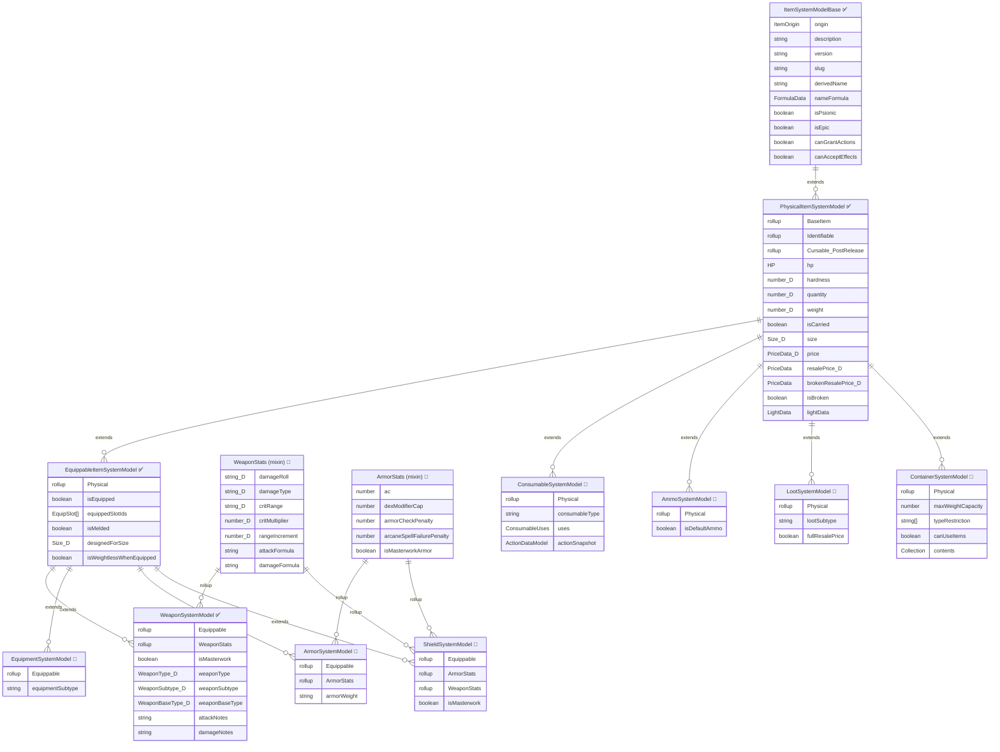

# 📘 Physical Item PropertyMap (Work in Progress)

Tangible objects that exist in the game world — weapons, armor, shields, gear, consumables, containers, trade goods.

> **Legend**: ✅ = Implemented | 🔲 = Planned | 📋 = Deferred | ⛔ = Removed
>
> Fields decorated with field metadata are marked with `🔷`.

---

## Inheritance Hierarchy

---

## Concrete Types

### Weapon ✅
Implemented. Melee and ranged weapons. Extends Equippable + WeaponStats.

`canGrantActions: true` | `canAcceptEffects: true` (materials, enhancements)

| Field | Type | Phase | Stored/Derived | D35E Source | Notes |
|-------|------|-------|----------------|-------------|-------|
| `isMasterwork` | boolean | 1 ✅ | Stored | `masterwork` | |
| `weaponType` | string 🔷 | 1 ✅ | Stored | `weaponType` | "simple"\|"martial"\|"exotic"\|"natural"\|"misc" |
| `weaponSubtype` | string 🔷 | 1 ✅ | Stored | `weaponSubtype` | "light"\|"1h"\|"2h"\|"ranged" |
| `weaponBaseType` | string 🔷 | 1 ✅ | Stored | `baseTypes` | e.g. "longsword" |
| *(WeaponStats mixin fields — see shared components)* | | 1 ✅ | | | |
| `attackNotes` | string | 1 ✅ | Stored | `attackNotes` | |
| `damageNotes` | string | 1 ✅ | Stored | — | |

### Armor 🔲
Body armor: padded through full plate. Extends Equippable + ArmorStats.

`canGrantActions: false` | `canAcceptEffects: true` (materials, enhancements)

D35E has armor as `equipment` with `equipmentType: "armor"`. We split it into its own type for cleaner modeling since armor has fundamentally different mechanical properties than wondrous items.

| Field | Type | Phase | Stored/Derived | D35E Source | Notes |
|-------|------|-------|----------------|-------------|-------|
| *(ArmorStats mixin fields — see shared components)* | | 15 🔲 | | | |
| `armorWeight` | string | 15 🔲 | Stored | `equipmentSubtype` | "light"\|"medium"\|"heavy" |

### Shield 🔲
Shields: light, heavy, tower. Extends Equippable + ArmorStats + WeaponStats.

`canGrantActions: true` (shield bash) | `canAcceptEffects: true` (materials, enhancements, shield spikes)

Split from armor because shields are both defensive AND offensive items. Shield bash uses the shared WeaponStats mixin for attack/damage. Shield spikes modify the bash damage and may warrant material treatment.

| Field | Type | Phase | Stored/Derived | D35E Source | Notes |
|-------|------|-------|----------------|-------------|-------|
| *(ArmorStats mixin fields — see shared components)* | | 15 🔲 | | | |
| *(WeaponStats mixin fields — see shared components)* | | 15 🔲 | | | For shield bash |
| `isMasterwork` | boolean | 15 🔲 | Stored | `masterwork` | |

### Equipment 🔲
Slotted equippable gear: rings, cloaks, boots, headbands, amulets, belts, etc. Extends Equippable.

`canGrantActions: true` (activated abilities) | `canAcceptEffects: true` (enhancements)

Equipment is any item that occupies a body equipment slot but isn't armor, a shield, or a weapon. The base item is **mundane** — a cloak is just a cloak. Magic comes from **enhancements** applied to the item (Cloak of Resistance = cloak + resistance enhancement). Slotless wondrous items (like Ioun Stones if treated as slotless) go under Loot instead.

| Field | Type | Phase | Stored/Derived | D35E Source | Notes |
|-------|------|-------|----------------|-------------|-------|
| `equipmentSubtype` | string | 15 🔲 | Stored | `equipmentSubtype` | "wondrous"\|"clothing"\|"other" |
| *(slot assignment via Equippable.equippedSlotIds)* | | | | `slot` | |

### Consumable 🔲
Items with charges that are expended on use. Subtypes distinguish behavior.

`canGrantActions: true` (action snapshot) | `canAcceptEffects: false` (self-contained)

Consumables store a **snapshot** of the action baked in at creation time. A potion of Bull's Strength cast at CL 3 with metamagic applied captures that moment — the `actionSnapshot` is an `EmbeddedDataField(ActionDataModel)` with all resolved values. At use time, the snapshot executes directly; only the *user's* situational modifiers (Use Magic Device, etc.) apply on top.

| Field | Type | Phase | Stored/Derived | D35E Source | Notes |
|-------|------|-------|----------------|-------------|-------|
| `consumableType` | string | 21 🔲 | Stored | `consumableType` | See subtypes below |
| `uses.value` | number | 21 🔲 | Stored | `uses.value` | Current charges |
| `uses.max` | number | 21 🔲 | Stored | `uses.max` | Max charges (wand=50, potion=1, scroll=1) |
| `uses.maxFormula` | string | 21 🔲 | Stored | `uses.maxFormula` | |
| `actionSnapshot` | ActionDataModel | 21 🔲 | Stored | — | Snapshot of the spell/effect at creation time |

**Consumable subtypes** (via `consumableType`):
| Subtype | Charges | Notes |
|---------|---------|-------|
| `potion` | 1 | Drink to apply spell effect. CL and spell baked in at creation |
| `scroll` | 1 | Cast a spell from it. Requires ability to cast; may need CL check |
| `wand` | 50 | 50 charges. Requires spell on your class list |
| `dorje` | 50 | Psionic wand equivalent |
| `powerstone` | 1 | Psionic scroll equivalent |
| `poison` | 1 | Applied to weapon or ingested. Saves, onset, frequency |
| `drug` | 1 | Like poison with addiction mechanics |
| `tattoo` | varies | Inscribed on body |
| `crystal` | varies | Psionic crystal |
| `misc` | varies | Catch-all |

### Ammo 🔲
Ammunition: arrows, bolts, bullets, sling stones. Extends Physical.

`canGrantActions: false` | `canAcceptEffects: true` (materials — cold iron arrows, silvered bolts; container AEs from quivers)

Ammo is its own type because it has unique lifecycle behavior (quantity decrement, weapon selection, quiver containment). **Most ammo does nothing to the attack** — ranged damage comes from the weapon (bow enchantment, etc.), not the arrow. Special ammo (magical, material-enhanced, alchemical) generates **combat AEs** that modify the weapon's attack action at roll time. These AEs come from the ammo's own Active Effects (materials, enhancements), not from schema fields.

| Field | Type | Phase | Stored/Derived | D35E Source | Notes |
|-------|------|-------|----------------|-------------|-------|
| `isDefaultAmmo` | boolean | 🔲 | Stored | — | Selected as default ammo for compatible weapons |

> **Ranged weapon integration**: When a ranged weapon attacks, it checks for selected ammo → if ammo has any active effects (own + container-granted), those AEs are applied to the attack action's derived data as combat AEs. If ammo has no effects (normal arrows), weapon attacks unmodified. After attack resolves, `ammo.quantity -= 1`. At quantity 0, ammo is depleted. Full design deferred to ranged weapons phase.

> **Quivers**: Containers (see Container type) with type restrictions (arrows only, bolts only) that can grant bonuses to contained ammo via the **Container AE Propagation** pattern. A Quick Draw Quiver grants a fast-draw AE to arrows inside it. When the ranged weapon consumes ammo, the ammo's effects — including quiver-bestowed ones — flow into the attack action.

### Loot 🔲
General non-equippable physical items: trade goods, gems, art objects, mundane gear, slotless trinkets.

`canGrantActions: true` (magicked objects) | `canAcceptEffects: true` (enhancements)

Loot is the **generic physical item** type. A bedroll, a rope, a gem, a slotless Ioun Stone — anything physical that doesn't equip into a body slot and isn't a weapon, armor, shield, consumable, ammo, or container. Like Equipment, the base item is mundane. Magic comes from **enhancements** applied to the item.

**Configurable subtypes**: `lootSubtype` is a free-form string from a configurable list (system setting). Users can add custom subtypes. Inventory UI can sort/filter/group by subtype. Default subtypes provided by the system, homebrew subtypes addable.

| Field | Type | Phase | Stored/Derived | D35E Source | Notes |
|-------|------|-------|----------------|-------------|-------|
| `lootSubtype` | string | 15 🔲 | Stored | `subType` | Configurable: "Adventuring Gear", "Trade Goods", "Valuables", etc. |
| `fullResalePrice` | boolean | 15 🔲 | Stored | `fullResalePrice` | true for gems/art objects (100% sell price) |

### Container 🔲
Bags, backpacks, quivers, pouches, chests — items that hold other items. Extends Physical.

`canGrantActions: false` | `canAcceptEffects: true` (enhancements — Bag of Holding, Quiver of Ehlonna)

Container is its own type because it has unique behavior: AE propagation to contained items, type restrictions, weight calculation overrides, and the AE-based containment system. This is enough specialized logic to justify a dedicated type rather than cramming it into Loot.

**Containers as AE generators**: Containers are fundamentally **AE generators** — their primary functional purpose is to create and manage Active Effects on contained items. When an item is placed in a container, the container creates a **container AE** on that item. When removed, the AE is deleted. The container AE links back to the container via UUID and carries the container's properties (weightlessness, bonuses, restrictions). There is no `containerId` pointer on the contained item — the AE *is* the containment relationship.

Containers compute `contents` by finding sibling items in `actor.items` that have a container AE originating from this container. All items remain flat siblings in the actor's item collection; Foundry V14 has no native item-in-item embedding.

**Container AE effects**: A bag of holding's container AE sets `isWeightless: true` on contained items. A quiver's container AE bestows bonuses to contained arrows (which then flow into ranged attack actions when the ammo is consumed). The container AE is the single source of truth for "this item is inside that container."

| Field | Type | Phase | Stored/Derived | D35E Source | Notes |
|-------|------|-------|----------------|-------------|-------|
| `maxWeightCapacity` | number | 15 🔲 | Stored | `capacity` | Maximum weight the container can hold (lbs). 0 = unlimited |
| `typeRestriction` | string[] | 15 🔲 | Stored | — | Item types/subtypes allowed (e.g. quiver: ["ammo"] only). Empty = any. |
| `canUseItems` | boolean | 15 🔲 | Stored | `containerCanUseItems` | Can items inside be activated? (e.g. handy haversack) |
| `contents` | Collection | 15 🔲 | Derived | — | Computed: sibling items that have a container AE originating from this container |

---

## Shared Components

### WeaponStats (mixin) 🔲
Shared by Weapon and Shield (for bash). The core combat data for anything that can deal damage.

| Field | Type | Stored/Derived | Notes |
|-------|------|----------------|-------|
| `damageRoll` | string 🔷 | Stored | e.g. "1d8", "1d4" (shield bash), "1d6" (ammo) |
| `damageType` | string 🔷 | Stored | e.g. "Slashing", "Bludgeoning", "Piercing" |
| `critRange` | string 🔷 | Stored | e.g. "19-20", "20" |
| `critMultiplier` | number 🔷 | Stored | e.g. 2, 3 |
| `rangeIncrement` | number 🔷 | Stored | Feet. 0 for melee |
| `attackFormula` | string | Stored | Bonus formula |
| `damageFormula` | string | Stored | Bonus formula |

### ArmorStats (mixin) 🔲
Shared by Armor and Shield.

| Field | Type | Stored/Derived | Notes |
|-------|------|----------------|-------|
| `ac` | number | Stored | Armor/shield bonus to AC |
| `dexModifierCap` | number\|null | Stored | Max DEX mod, null = unlimited |
| `armorCheckPenalty` | number | Stored | Negative number |
| `arcaneSpellFailurePenalty` | number | Stored | Percentage |
| `isMasterworkArmor` | boolean | Stored | -1 ACP |

### Identifiable ✅
| Field | Type | Stored/Derived | Notes |
|-------|------|----------------|-------|
| `isIdentifiable` | boolean | Stored | Can this item be unidentified? |
| `isIdentified` | boolean | Stored | Is it currently identified? |

> ⚠️ Identifiable needs system-wide redesign. See actor PropertyMap for details.

### HP ✅
| Field | Type | Stored/Derived | Notes |
|-------|------|----------------|-------|
| `hp.value` | number (Derived) | Derived | Current HP |
| `hp.max` | number (Derived) | Derived | Max HP (from material/size) |

### Cursable � (Post-Release)
| Field | Type | Stored/Derived | Notes |
|-------|------|----------------|-------|
| `isCursed` | boolean | Stored | Is this item cursed? |
| `isCurseActive` | boolean | Stored | Is the curse currently manifesting? |

> 📋 **Deferred to post-release phase.** Curse detection, identification interaction, and remove-curse workflows are complex enough to warrant their own phase. Fields remain in the diagram for reference.

---

## Decisions Made

- **Armor is its own type, not a subtype of Equipment**: Armor has mechanical fields (AC, max DEX, ACP, spell failure, weight category) that don't exist on wondrous items. Separate type = cleaner schema, simpler sheets.
- **Shield stays split**: Both defensive (ArmorStats) and offensive (WeaponStats for shield bash). Shield spikes are a future materials/enhancement conversation.
- **WeaponStats is a shared mixin**: Weapon and Shield both consume the same combat data schema. Avoids duplication and ensures consistent attack/damage structure across all three.
- **Consumables are one type with subtypes**: Potions, scrolls, wands, etc. share identical data structure. The `consumableType` field drives behavior differences in code, not schema differences.
- **Consumable stores an action snapshot**: A potion/scroll/wand captures the spell effect at creation time as an `ActionDataModel`. This is a snapshot — not a reference to a spell document. The snapshot includes CL, metamagic, and any bonuses the creator had.
- **Valuable merged into Loot**: `valuable` was just loot with full resale price. Now `lootSubtype: "Valuables"` + `fullResalePrice: true`. One fewer item type to maintain.
- **Loot has configurable subtypes**: `lootSubtype` is a free-form string from a system-configurable list. Users can add custom subtypes ("Adventuring Gear", "Trade Goods", "Valuables", etc.). Inventory can sort/filter/group by subtype. (maybe we move extending this list to settings.)
- **Container is its own type**: Containers have unique behavior (AE generation/propagation, type restrictions, weight overrides) that justifies a dedicated type rather than being a Loot subtype.
- **Ammo is its own type**: Extends Physical only (no WeaponStats). Normal ammo has no effect — ranged damage comes from the weapon. Special ammo's bonuses come from Active Effects on the ammo item (materials, enhancements), not schema fields. These AEs generate combat modifiers at attack time.
- **Containers are AE generators**: Containers establish containment by creating a container AE on the target item — there is no `containerId` field. The container AE links back via UUID and carries the container's properties (weightlessness, quiver bonuses, type restrictions). This replaces manual weight calculation logic — bag of holding weightlessness is "just an AE", quiver bonuses bestow to arrows, etc. When items enter/leave a container, the container AE is created/removed. All items remain flat siblings in `actor.items`.
- **Equipment and Loot can both be magicked**: The base item is mundane. Magic comes from enhancements. Equipment = slotted (rings, cloaks, etc.). Loot = slotless (trinkets, mundane gear). Both `canAcceptEffects: true`.
- **Damage types are config data, not items**: Hardcoded defaults with system setting overrides for homebrew extensibility. Not a Foundry item type.
- **canGrantActions / canAcceptEffects**: Per-type constants on BaseItem configuring whether each concrete type can own actions and/or receive Active Effects. Set at the item type level.
- **Containers cannot house containers**: No nesting. A container's `typeRestriction` excludes the container type by default. Avoids recursive AE propagation entirely. Will be reviewed at Phase 15 start for edge cases.
- **Cursable deferred to post-release**: The Cursable mixin remains in the schema diagram for reference but will not be implemented in the initial release.
- **Illuminable folded into Physical**: Light settings (`lightData`) are optional fields directly on PhysicalItemSystemModel — not a separate mixin. A torch stores its light description (radius, color, intensity, animation). When activated/equipped, the item generates an AE that applies those settings to the token's light configuration. AE generator pattern: item stores the data, AE transmits the effect.

---

## Needs Discussion

### Shield Spikes as Material Subtype (Phase 23)
Shield spikes will be a **material subtype** that conveys damage modifications to the shield's WeaponStats (bash). This raises broader Phase 23 questions:

- Do different material types need a **dynamic details page** that changes based on material subtype? (Spikes need damage fields; adamantine needs hardness/DR fields; mithral needs weight reduction.)
- At that point, should materials just be **different effect types** on the AE system rather than a dedicated material subsystem?

Deferred to Phase 23 design session.

### Container Nesting - Review at Phase Start
**Containers cannot house other containers.** A bag of holding cannot be placed inside another bag of holding (this also avoids the recursive AE propagation question entirely). The `typeRestriction` field should exclude the container type by default.

> Review at phase start: This constraint will be re-evaluated when Phase 15 implementation begins, similar to the compendium JSON vs YAML decision. Edge cases (e.g. a chest containing a pouch?) may warrant loosening.

---

## Deferred to Other Phases (Reference)

These items were previously in Needs Discussion but belong to other phases:

- **Enhancement / Material System**: Phase 23. Pricing formulas, name composition, embedded enhancement items, compatibility rules.
- **DR Type Extensibility**: Combat phase. Robust, extensible DR bypass system for both RAW and homebrew types.
- **Ammo Full Integration**: Ranged weapons phase. Ammo selection UI, multi-ammo loading, AE composition with weapon AEs.
- **D35E Enhancement Sub-Item Pattern**: Historical reference for Phase 23. D35E uses `system.enhancements.items[]` as raw JSON array. See Phase 23 plan doc.
