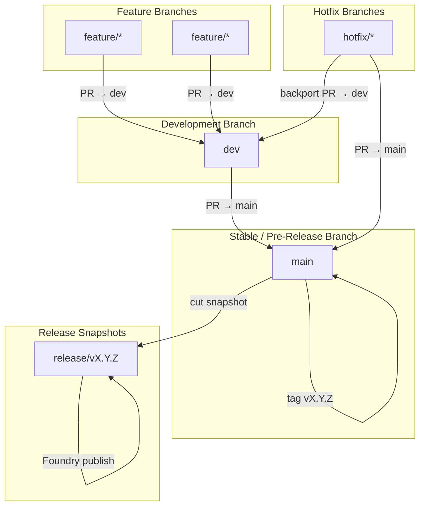

# D&D 3.5e System — Branching, Release, and Publishing Strategy

This document is the **source of truth** for contributors and automation. It covers:

- Branching model
- Milestones and story workflow
- Development workflow
- Release workflow
- Hotfix workflow
- Branch protection rules

---

## 1. Branching Model Overview

```
feature/* ──► dev ──► main ──► tag ──► release/*
                                          │
                                    Foundry publish
```

Hotfixes follow a parallel path that bypasses `dev`:

```
hotfix/* ──► main ──► tag ──► release/vX.Y.Z+1
       └────────────────────► dev  (backport)
```

### Branch Purposes

| Branch | Purpose |
|--------|---------|
| `feature/*` | Individual stories or tasks. Branched from `dev`. |
| `dev` | Integration branch. All new work lands here first. Bleeding-edge builds available to power users from this branch. |
| `main` | Stable, pre-publish code. Near-release builds available to power users here before Foundry submission. |
| `release/*` | Published release snapshots. Cut from `main` at a tag. Read-only after publish. |
| `hotfix/*` | Emergency fixes applied directly to `main` (and backported to `dev`). |

### Core Principles

- All new work enters through `feature/*` → `dev`.
- `main` only receives PRs from `dev` (normal) or `hotfix/*` (emergency).
- Tags on `main` are the canonical release markers.
- `dev` always stays ahead of `main`.
- Broken tests never merge to `dev` or `main`.

---

## 2. Milestones & Story Workflow

Milestones are organized by **wave** and named by their phase identifier. Each wave restarts numbering at `01`:

```
poc.N        — <Title>     (Proof of Concept)
alpha.N      — <Title>     (Paladin vs Dragon)
beta.N       — <Title>     (Full System Coverage)
release.N    — <Title>     (Migration & Content)
post.N       — <Title>     (Hardening & Bonus Features)
```

Milestones are **generated from `docs/migration-plan/phases.json`** — the single source of truth for the roadmap. To add or rename a milestone, edit `phases.json` and push to `dev`. The `sync-phases.yml` workflow creates/updates the GitHub milestone automatically.

A wave's overall release tag (e.g. `v14.0.0-alpha.1`) is decided by what's bundled at release time — it does not need to mirror an individual milestone name.

### Stories (Issues)

Each milestone is composed of Issues representing discrete units of work. Stories should include:

- Labels (`feature`, `bug`, `enhancement`, etc.)
- Acceptance criteria
- Subtasks if needed
- Links to related issues/PRs

### Working a Story

1. Branch from `dev`:
   ```
   feature/<short-description>
   ```
2. Implement the work.
3. Open a PR targeting `dev`.
4. Pass required checks (lint, build, tests).
5. Obtain required approvals.
6. Merge into `dev`.

When all milestone stories are complete and `dev` is stable, promote to a release (see §4).

---

## 3a. Issue Labels

Labels are defined in `.github/labels.yml` and synced to GitHub automatically whenever that file changes on `dev` (via `sync-labels.yml`).

The **phase label section** of `labels.yml` is generated from `docs/migration-plan/phases.json`. Regeneration is automatic in two places:

1. **Local builds** — `npm run build` runs `generate:labels` as part of `prebuild`, so any drift is caught before push.
2. **CI on `dev`** — when `phases.json` changes on `dev`, `sync-phases.yml` regenerates `labels.yml` and commits the result back to `dev` if it drifted (covers the case where `phases.json` is edited directly via the GitHub UI).

To regenerate manually:

```
npm run generate:labels
```

The generator replaces the section between the `BEGIN GENERATED PHASE LABELS` / `END GENERATED PHASE LABELS` sentinel comments. Other labels (`type:`, `status:`) are hand-edited and untouched by the generator.

**Label categories:**

| Prefix | Purpose |
|--------|---------|
| `type: *` | Kind of work (feature, bug, enhancement, chore, docs, test) |
| `status: *` | Workflow state (needs review, blocked, good first issue, etc.) |
| `poc: NN — Title` | POC wave phases |
| `alpha: NN — Title` | Alpha wave phases |
| `beta: NN — Title` | Beta wave phases |
| `release: NN — Title` | Release wave phases |
| `post: NN — Title` | Post-Release wave phases |

**Assigning labels to tickets:** Any team member can assign one or more labels to an issue or PR from the GitHub sidebar. The wave label is the primary way to organize work by roadmap position.

**Adding a new phase:**
1. Add an entry to `docs/migration-plan/phases.json`
2. Commit and push to `dev` (label regeneration happens automatically via `prebuild` locally and via `sync-phases.yml` on the runner)
3. `sync-labels.yml` creates the new label on GitHub
4. `sync-phases.yml` creates the matching milestone on GitHub

---

## 3. Development Phase (`dev`)

`dev` is the integration branch for all new work.

### Rules

- PRs only from `feature/*` or `hotfix/*` (backport only).
- Must pass all checks: lint, typecheck, tests.
- Must be approved by at least one team member.
- No tags or releases are created directly from `dev`.

---

## 4. Release Workflow

```
dev ──► PR (version bump) ──► dev ──► PR ──► main ──► auto-tag.yml ──► tag vX.Y.Z ──► build.yml ──► GitHub Release ──► Foundry publish
                                                                                            └──► cut release/vX.Y.Z (read-only snapshot)
```

`main` is protected — no direct commits or tag pushes from a developer's machine. The release flow uses a version-bump PR on `dev`, then a `dev → main` PR, then automation does the rest.

### Step-by-step

1. **Decide the next version** (e.g. `14.0.0-alpha.1`).
2. **Branch from `dev`**: `release-prep/v14.0.0-alpha.1`.
3. **Bump the version** in `package.json`:
   ```
   npm pkg set version=14.0.0-alpha.1
   git add package.json package-lock.json
   git commit -m "Update release version to 14.0.0-alpha.1"
   git push -u origin release-prep/v14.0.0-alpha.1
   ```
   `package.json` is the **single source of truth** for the version — `system.json` is generated from `system.json.template` at build time with the version substituted in.
4. **Open PR → `dev`**, get CI green and one approval, merge.
5. **Open release PR → `main`** (base `main`, compare `dev`). Title: `release: v14.0.0-alpha.1`.
6. **Merge** the release PR.
7. **`auto-tag.yml` triggers automatically** on the push to `main`:
   - Diffs `package.json` against the previous commit
   - If the `version` field changed and the tag doesn't already exist, it creates and pushes `v14.0.0-alpha.1`
   - No manual `git tag` is required
8. **`build.yml` triggers on the new tag**:
   - Validates the tag version matches `package.json`
   - Runs the full build (lint + typecheck + Vite + system.json generation)
   - Zips `dist/` and uploads `dnd35e-dist-vX.Y.Z.zip` + `system.json` as release assets
   - Sets `prerelease: true` for any tag containing a `-` suffix (e.g. `-poc.`, `-alpha.`, `-beta.`, `-rc.`); bare `vMAJOR.MINOR.PATCH` tags are stable releases
9. **Cut a `release/vX.Y.Z` branch** from the tag as a read-only snapshot.
10. **Publish to Foundry** (the `manifest` URL in `system.json` points at `releases/latest/download/system.json`, so Foundry users get auto-update notifications).
11. **Close the milestone(s)** included in this release; resume work on `dev`.

### Manual override

If `auto-tag.yml` ever needs to be bypassed (e.g. retagging an existing version, releasing without a version change), an admin can push the tag manually — `build.yml` only cares that the tag was pushed, not how.

### Allowed version formats

`auto-tag.yml` validates the version on every push to `main` and **rejects anything that doesn't match**:

```
MAJOR.MINOR.PATCH                          # stable release       — e.g. 14.0.0
MAJOR.MINOR.PATCH-<channel>.N              # prerelease           — e.g. 14.0.0-poc.1
MAJOR.MINOR.PATCH-<channel>.N.N(.N…)       # prerelease patch     — e.g. 14.0.0-poc.3.1
```

Where `<channel>` is one of: **`poc`**, **`alpha`**, **`beta`**, **`rc`**. The trailing numeric segments after the channel can be one or more dot-separated integers, so iterations on a prerelease (e.g. a hotfix to `poc.3` becomes `poc.3.1`) are valid. Anything else (e.g. `14.0.0-zulu`, `14.0.0-alpha`, `14.0`) fails the validation step and no tag is pushed. Fix the version on a follow-up `release-prep/*` PR and re-merge.

---

## 5. Hotfix Workflow

Hotfixes address urgent bugs discovered after a release, when `dev` contains unreleased work that must not ship yet.

> **Note**: This workflow has not yet been exercised — we have not cut a real release yet. The shape below is the agreed design. If anything needs adjusting when the first hotfix arises, update this section.

### Creating a Hotfix

Branch from `main` (not `dev`):

```
hotfix/<short-description>
```

### Required PR Targets

| Scenario | Required PR targets | New release tag? |
|----------|---------------------|-----------------|
| Bug exists in `main` | `main` then backport to `dev` | Yes (`v14.0.X`) |

### Hotfix Tags

If merged into `main`, tag a patch release:

```
v14.0.1
v14.0.2
```

Hotfix releases are always stable (no `-alpha` / `-beta` suffix).

### Backport Rule

Every hotfix that lands in `main` **must** be backported to `dev` via a separate PR, so `dev` does not re-introduce the same bug on the next regular release.

---

## 6. Branch Protection Rules

### `dev`

- PRs only from `feature/*` or `hotfix/*` (backports)
- Required checks: lint, typecheck, `test.yml`
- Required approvals: at least 1 team member

### `main`

- PRs only from `dev` or `hotfix/*`
- Required checks: lint, typecheck, `test.yml`
- Required approvals: at least 1 team member (PM or Jake for hotfixes)

### `hotfix/*`

- Required checks: lint, typecheck, `test.yml`
- Required approvals: PM + Jake

---

## 7. Summary Diagram



---

## 8. Background

Strategy agreed in team Discord discussion (2026-02-07). Key decisions:

- **Keep it simple** — small team, Foundry users update eagerly, no need for multiple live versions.
- **`dev` is staging** — power users pull from `dev` for bleeding-edge builds, `main` for near-release builds.
- **Tags are the canonical version markers** — a tag on `main` triggers the release build.
- **Hotfix path defined but not yet exercised** — agreed design is documented here; refine when the first real hotfix arises.
- **Bug fixes go in next release** — no backport-to-release maintenance, because Foundry users update promptly.
