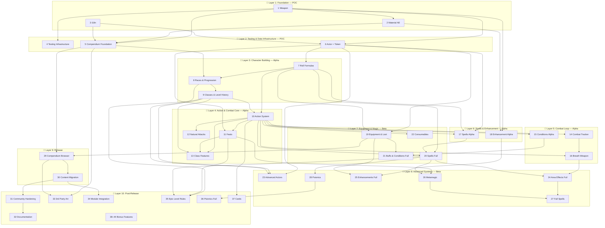

# D35E → dnd35e Migration Plan

> Rebuild of the legacy D35E system into a modern Foundry VTT v14 system using TypeScript, Vue 3, Vite, and modern data model patterns.

---

## Table of Contents

- [Architecture Principles](#architecture-principles)
- [Milestones](#milestones)
  - [POC — Proof of Concept (Phases 1–7)](#poc--proof-of-concept-phases-17)
  - [Alpha — Paladin vs Dragon (Phases 8–18)](#alpha--paladin-vs-dragon-phases-818)
  - [Beta — Full System Coverage (Phases 19–28)](#beta--full-system-coverage-phases-1928)
  - [Release — Migration & Content (Phases 29–30)](#release--migration--content-phases-2930)
  - [Post-Release — Hardening & Bonus Features (Phases 31+)](#post-release--hardening--bonus-features-phases-31)
- [Current State](#current-state)
- [Status Legend](#status-legend)
- [Phase Overview](#phase-overview)
  - [Layer 1: Foundation](#layer-1-foundation)
  - [Layer 2: Testing & Data Infrastructure](#layer-2-testing--data-infrastructure)
  - [Layer 3: Character Building — Alpha](#layer-3-character-building--alpha)
  - [Layer 4: Action & Combat Core — Alpha](#layer-4-action--combat-core--alpha)
  - [Layer 5: Combat Loop — Alpha](#layer-5-combat-loop--alpha)
  - [Layer 6: Spells & Enhancement — Alpha](#layer-6-spells--enhancement--alpha)
  - [Layer 7: Beta — Equipment & Magic](#layer-7-beta--equipment--magic)
  - [Layer 8: Beta — Advanced Systems](#layer-8-beta--advanced-systems)
  - [Layer 9: Release — Migration & Content](#layer-9-release--migration--content)
  - [Layer 10: Post-Release](#layer-10-post-release)
- [Dependency Graph](#dependency-graph)

---

## Architecture Principles

| Principle | Description |
|-----------|-------------|
| **One type at a time** | Add one representative of each document type, get it working end-to-end, then expand |
| **Active Effects over embedded logic** | Anything that *modifies* another document's data should be an Active Effect type, not baked-in item logic. Items that grant bonuses dynamically generate AE changes in `prepareDerivedData()` (the Material pattern). |
| **Component composition** | Use the existing mixin/component pattern (`PhysicalItem → EquippableItem → Weapon`) rather than deep inheritance |
| **Vue 3 + Pinia sheets** | All sheets are Vue SFC apps with Pinia stores (already established) |
| **Type-safe schemas** | `DataModel` subclasses with `defineSchema()` for every document type |
| **Formula system** | Leverage FormulaFamiliar with `#context.property` syntax for all computed values |
| **Two-phase effect application** | Initial phase (during `prepareEmbeddedDocuments`) and Final phase (during `prepareDerivedData`) |
| **Actions live on items** | Items own their actions via the Action System; actions can be checks, attacks, spell casts, and can be chained into sequences |
| **Localize early** | All user-facing strings use i18n keys — no hardcoded English. Pre-localize CONFIG objects at init time. |
| **Compendium as source of truth** | All SRD content stored as JSON in source, built to Foundry packs. Compendium browsers provide amalgamated cross-pack search. |
| **Bonus type stacking** | Stacking engine with `bonusType` field. Highest-wins resolution (except dodge/untyped/circumstance — always stack). Penalties always apply. |
| **Document store refresh on update** | Override `update()` on all document classes to refresh active Pinia stores, ensuring Vue reactivity stays in sync with Foundry's data layer |
| **Build toward the Action System** | Every phase that touches combat data (BAB, saves, AC, feats, conditions) is designed knowing its output will feed the ActionDataModel, TurnActionBudget, and ExecutionEngine. No throwaway combat code. |
| **Building-block phases** | Each phase produces a testable building block that unlocks the next. Phases are layered by *system dependency*, not by item type. |
| **Combat state on `system` fields** | Turn economy (TurnActionBudget) and other combat runtime state is persisted via `Combatant.system` using a `TypeDataModel` schema — not in-memory Maps or transient class properties. Foundry stores Combat/Combatant documents in LevelDB (`combats.db`), so all combat state survives server restarts. Players can update their own combatant's `system` data per Foundry's permission model. |

---

## Milestones

### POC — Proof of Concept (Phases 1–7)

**Goal**: Foundation, data infrastructure, and testing patterns — every building block exists in isolation before being composed. Items, Active Effects, actors, tokens, rolls, compendium foundations, and the test framework all work independently.

**What POC includes**:
- Weapon item with full DataModel, mixin chain, Vue sheet, Identifiable mixin
- Material AE with phase system, stacking engine, proxy dispatcher
- Localization infrastructure (LOCALIZATION_PREFIXES, lang files, FormGroup auto-labels)
- Testing infrastructure (Vitest, integration harness, mock helpers, CI pipeline) — patterns established early so every subsequent phase includes tests
- Compendium foundation (pack pipeline, origin tracking, UUID helpers, migration version field)
- Actor foundation (Character actor: abilities, AC shell, HP, saves, skills, inventory, tokens, equipment slots)
- Roll formulas (D20Roll, DamageRoll, FormulaFamiliar roll data, formula paths)

**What POC does NOT include**: Classes, races, feats, combat, spells, conditions, or any gameplay logic.

**POC exit criteria**: A Character actor exists on a scene with derived ability scores, saves, HP, and skills. Weapons can be created, identified, and equipped. Material AEs modify item stats with correct stacking. Roll formulas resolve with FormulaFamiliar context. Compendium items can be imported with origin tracking. All strings are localized. Test framework is in place with unit/integration test examples covering Phases 1–3.

---

### Alpha — Paladin vs Dragon (Phases 8–18)

**Goal**: A playable combat scenario proving "one of everything" — every building block composed end-to-end. A level 5 Paladin (Human) with a +1 longsword and a Young Adult Black Dragon fight on a grid. The Paladin proves class features, spellcasting (RAW), enhancement stacking, and morale bonus collision. The Dragon proves natural attacks, breath weapon, monster class progression, and frightful presence.

**What Alpha includes**:
- Two races: Human (simple) and Black Dragon (monster class progression, locked levels, natural armor, breath weapon, flight, immunities)
- One class: Paladin (Med BAB, Good Fort, level-up, class features via grant schedule)
- Class features: Divine Grace (CHA → saves), Smite Evil (per-day toggle), Lay on Hands (pool-based healing), Aura of Courage (+4 morale vs fear)
- RAW Paladin spellcasting: 1st-level spells (Bless, Protection from Evil, Divine Favor, Cure Light Wounds)
- +1 longsword (enhancement AE on weapon, +1 enhancement to attack/damage)
- Three feat archetypes: passive (Weapon Focus), toggle (Power Attack), trigger (Cleave)
  - Level 1 character feat: Power Attack (STR 13 ✓)
  - Level 1 Human bonus feat: Weapon Focus (Longsword) (BAB +1 ✓)
  - Level 3 character feat: Cleave (requires Power Attack ✓)
- Action System: ActionDataModel, chains, execution engine, combat maneuvers (trip, grapple, bull rush)
- Natural attacks: bite, claw, wing, tail — primary/secondary rules, multi-attack
- Combat tracker with initiative, turns, TurnActionBudget state machine, progressive full attack
- Breath weapon: 80ft line of acid, Reflex save, area template (line/cone)
- Conditions: Prone (trip pipeline), Frightful Presence → Shaken/Frightened (fear track stub)
- Per-attack chat cards with stacking history showing bonus type collision resolution
- **Stacking proof**: Aura of Courage (+4 morale) vs Bless (+1 morale) on saves vs fear — engine picks +4, rejects +1, chat card shows suppression reason

**What Alpha does NOT include**: Equipment AC (flat numbers only), full spellbook system (only Paladin 1st-level), psionics, consumables, NPC actor type (Dragon is a Character with progression), full enhancements (+2 through +5, special abilities), auras affecting allies, full condition set, data migration.

**Alpha exit criteria**: A GM can create a level 5 Paladin (Human) with a +1 longsword and a Young Adult Black Dragon (built via monster class progression), enter combat, roll initiative, take turns with the progressive full attack state machine, apply Power Attack per-attack, get a Cleave bonus attack on kill, activate Smite Evil via PreRollDialog, use Lay on Hands to heal, cast Bless and Divine Favor (RAW spell slots), see morale stacking collision on fear saves (Aura of Courage +4 suppresses Bless +1), trip an enemy to apply Prone, use a breath weapon (line template with Reflex save), trigger Frightful Presence (Will save vs fear with Aura of Courage granting +4 morale), see natural attacks use primary/secondary rules, see +1 enhancement bonus from longsword in stacking breakdown, and view all results in per-attack chat cards.

---

### Beta — Full System Coverage (Phases 19–28)

**Goal**: Expand from one-of-everything to complete D&D 3.5e system coverage. All item types, NPC/Object/Trap actor types, full condition/buff system, full spellcasting, equipment with AC, full enhancements, companions, psionics.

**Progression philosophy**: Alpha built the engine and proved the architecture handles real D&D complexity. Beta puts more content through it — more item types, more conditions, more feat patterns, full spellcasting. Each new content type proves a variation of the existing architecture, not a new architecture.

> **📌 Milestone placement notes**:
> - **Epic Level Rules**: Post-Release — epic is SRD content and exists in D35E.
> - **Psionics**: Beta (foundation) + Post-Release (full). SRD OGC content, exists in D35E.
> - **Cards**: Post-Release. Card decks exist in D35E — small utility, can wait.
> - **Post-Release (Bonus)**: Features that do NOT exist in D35E (Sight/Concealment, Stat Block, Vigor/Wound, Environmental Hazards, Random Treasure Gen, Variant Rules, Divine Rules).

---

### Release — Migration & Content (Phases 29–30)

**Goal**: Migrate existing D35E worlds and content to the new system. Compendium browser & management, SRD content packs, world migration tools.

---

### Post-Release — Hardening & Bonus Features (Phases 31+)

**Goal**: Community hardening, documentation, third-party integrations, and bonus features. Epic level rules, full psionics, cards, divine rules, variant rules, and features that don't exist in D35E.

---

## Current State

| Component | Status | Notes |
|-----------|--------|-------|
| **Weapon** item type | � Planned | Data model done. Vue sheet details, effects tab, tests remaining. |
| **Material** active effect | ✅ Approved | Material AE pattern established. Stacking engine, GeneralSystemModel, v14 CONFIG setup, integration designed. |
| **PhysicalItem / EquippableItem** chain | � Planned | Weight, price, hardness, HP, equipment slots — schema done, tests remaining |
| **Identifiable document** mixin | � Planned | Tracked/identified states with formula-driven names. Uses `system.slug` |
| **Actor (character)** type shell | ✅ Exists | Shell only — no meaningful system data yet |
| **Token / Scene** type wrappers | ✅ Exists | Type aliases, no custom logic |
| **Active Effect phase system** | ✅ Approved | Phase system, stacking engine, GeneralSystemModel designed in Phase 2. v14 CONFIG integration planned. |
| **Settings framework** | ✅ Complete | Combat, display, health, roll, skills, currency, game rules categories |
| **FormulaFamiliar system** | ✅ Complete | Schema-driven autocomplete with `#context.property` syntax |
| **Build pipeline** | ✅ Complete | Vite + Vue SFC + SASS + lang merge |

---

## Status Legend

| Symbol | Meaning | Description |
|--------|---------|-------------|
| 📄 Stub | Stub | It's an idea — no ideation done. Phase file is just loose notes. |
| 📖 Rough Sketch | Rough Sketch | Fleshed-out ideas exist, but major design questions remain. |
| 📋 Outlined | Outlined | Well thought out — maybe a couple of open questions. |
| 📝 Planned | Planned | Confident enough to execute independently without design issues. |
| ✅ Approved | Approved | Reached Planned, then confirmed by the user. |
| 🔶 In Progress | In Progress | Approved and actively being implemented. |
| ✅ Complete | Complete | All work items finished. |
| 🔒 Hardened | Hardened | Tested by users and considered bug-free. |

---

## Phase Overview

The plan is organized into **layers**. Each layer builds on the one before it. Within a layer, phases may run in parallel where dependencies allow.

### Layer 1: Foundation

| # | Phase | Status | Dependencies | Notes |
|---|-------|--------|--------------|-------|
| 1 | [Item Foundation (Weapon PoC)](phase-01-item-foundation.md) | ✅ Approved | — | Weapon DataModel, mixin chain, Vue sheet, Identifiable |
| 2 | [Active Effect on Item (Material)](phase-02-active-effect-on-item.md) | ✅ Approved | Phase 1 | Material AE, phase system, stacking engine, proxy dispatcher, GeneralSystemModel |
| 3 | [Localization](phase-03-localization.md) | ✅ Approved | — | LOCALIZATION_PREFIXES, lang files, FormGroup auto-labels |

**What Layer 1 proves**: Items exist with schemas. AEs modify items. Stacking works. i18n works.

---

### Layer 2: Testing & Data Infrastructure

| # | Phase | Status | Dependencies | Notes |
|---|-------|--------|--------------|-------|
| 4 | [Testing Infrastructure](phase-04-testing-infrastructure.md) | � Planned | 1 | Vitest, Foundry mocks, coverage tooling — establishes test patterns; back-fills Phase 1–3 tests |
| 5 | [Compendium Foundation](phase-05-compendium-foundation.md) | 📝 Planned | 1, 2, 3 | Pack pipeline, origin tracking, UUID helpers, migration version field |
| 6 | [Actor Foundation](phase-06-actor-foundation.md) | 📋 Outlined | 1, 3 | Character actor: abilities, AC shell, HP, saves, skills, inventory, tokens, equipment slots |

**What Layer 2 proves**: The test framework is in place with patterns every phase will follow. Actors exist with derived stats. Compendium items can be sourced. Tokens appear on scenes.

> **Phase 6 includes Token & Scene**: Token placement, size derivation, Pinia token store, and actor ↔ token linking are part of getting actors visible on the table. The TargetingManager stub and movement/action economy integration remain in Phase 14 (Combat Tracker).

---

### Layer 3: Character Building — Alpha

| # | Phase | Status | Dependencies | Notes |
|---|-------|--------|--------------|-------|
| 7 | [Roll Formulas & Custom Rolls](phase-07-roll-formulas.md) | 📋 Outlined | 6 | D20Roll, DamageRoll, FormulaFamiliar roll data, formula paths |
| 8 | [Races & Progression](phase-08-races-progression.md) | 📋 Outlined | 5, 7 | Race item, creature types, Progression component, grant system, monster class progression, natural armor, senses, Human + Black Dragon |
| 9 | [Classes & Level History](phase-09-classes-level-history.md) | 📋 Outlined | 8 | Class item, level-up flow, BAB/save aggregation, skills, milestones, multiclass, Paladin |

**What Layer 3 proves**: A Human Paladin can be leveled to 5. A Black Dragon can be built via monster class progression. Both have BAB, saves, HP, skills, and granted feats — all derived from the level history ledger. Rolls work with proper modifiers.

> **Races and Classes share the Progression component**. Both phases use the same Progression data structure. Phase 8 builds it; Phase 9 reuses it. Classes depend on Races because both use the same grant scheduling and level history infrastructure.

---

### Layer 4: Action & Combat Core — Alpha

| # | Phase | Status | Dependencies | Notes |
|---|-------|--------|--------------|-------|
| 10 | [Action System](phase-10-action-system.md) | 📋 Outlined | 7, 9 | ActionDataModel, execution engine, attack/damage, chat cards, combat maneuvers (trip, grapple, bull rush), per-attack chat cards, stacking history display |
| 11 | [Feats (Alpha)](phase-11-feats-alpha.md) | 📋 Outlined | 6, 10 | Feat item, 3 archetypes: passive (Weapon Focus), toggle (Power Attack), trigger (Cleave). PreRollDialog. Conditional bonuses. |
| 12 | [Natural & Special Attacks](phase-12-natural-attacks.md) | 📋 Outlined | 10 | Natural attack item type, primary/secondary, multi-attack full-attack generation, TWF iteratives, bite/claw/wing/tail for Dragon |
| 13 | [Class Features (Alpha)](phase-13-class-features-alpha.md) | 📋 Outlined | 9, 10, 11 | Paladin: Divine Grace (CHA→saves), Smite Evil (per-day toggle), Lay on Hands (pool healing), Aura of Courage (+4 morale vs fear) |

**What Layer 4 proves**: The Paladin can attack with a longsword, apply Power Attack, and Cleave on kill. Divine Grace adds CHA to saves. Smite Evil toggles via PreRollDialog. Lay on Hands heals. Aura of Courage provides +4 morale on fear saves. The Dragon can full-attack with bite + 2 claws + 2 wings + tail. Trip applies Prone. All results appear in chat cards with stacking breakdowns.

> **Action System stays monolithic**: Combat maneuvers (trip, grapple, bull rush, disarm, sunder, overrun) live here because Trip → Prone is an Alpha exit criterion. The engine is large but cohesive — splitting it would create artificial seams.

> **Natural Attacks are Alpha**: The Dragon cannot exist without natural attacks. Primary/secondary attack classification, multi-attack full attacks, and the iterative attack generator are required for the Alpha combat scenario.

> **Class Features are a separate phase**: Phase 9 builds the progression infrastructure (BAB, saves, HD, skills). Phase 13 implements what the progression grants — the Paladin's class features that use the Action System and AE Generator pattern.

---

### Layer 5: Combat Loop — Alpha

| # | Phase | Status | Dependencies | Notes |
|---|-------|--------|--------------|-------|
| 14 | [Combat Tracker & Turn Economy](phase-14-combat-tracker.md) | 📋 Outlined | 10 | Initiative, TurnActionBudget state machine, progressive full attack, token movement with action cost, turn hooks, flat-footed |
| 15 | [Conditions (Alpha)](phase-15-conditions-alpha.md) | 📋 Outlined | 10 | Prone (trip pipeline), Frightful Presence → Shaken/Frightened (fear track stub), condition manager, token icons, stand-up action |
| 16 | [Breath Weapon & Area Templates](phase-16-breath-weapon.md) | 📋 Outlined | 10, 14 | Line and cone MeasuredTemplate placement, Reflex save workflow, area damage application, breath weapon recharge. Minimal — just enough for Black Dragon's 80ft acid line. |

**What Layer 5 proves**: Full combat loop works. Initiative → turns → actions → movement → end turn. The Paladin takes a full attack, the Dragon uses breath weapon (line template, Reflex save), Frightful Presence triggers on approach (Will save with Aura of Courage granting +4 morale), Trip → Prone works end-to-end, TurnActionBudget tracks action economy.

> **Breath Weapon is minimal**: Only implements line and cone templates with Reflex saves — no aura regions, no persistent effects, no duration tracking. This is the minimum to make the Dragon's breath weapon work. Full area effects (Phase 24) are Beta.

---

### Layer 6: Spells & Enhancement — Alpha

| # | Phase | Status | Dependencies | Notes |
|---|-------|--------|--------------|-------|
| 17 | [Spells (Alpha)](phase-17-spells-alpha.md) | 📋 Outlined | 6, 7, 10 | Spell item type, Paladin spellbook, 1st-level slots, cast action, Bless/Protection from Evil/Divine Favor/Cure Light Wounds |
| 18 | [Enhancement (Alpha)](phase-18-enhancement-alpha.md) | 📋 Outlined | 1, 2 | +1 longsword: minimal EnhancementSystemModel, one AE with +1 enhancement to attack/damage |

**What Layer 6 proves**: Paladin casts RAW spells from prepared slots (not class-feature workarounds). Bless (+1 morale) collides with Aura of Courage (+4 morale) on fear saves — stacking engine picks +4 and shows suppression in chat card. Enhancement bonus type works on weapons. Multiple bonus types stack correctly on attack rolls: BAB (base) + STR (ability) + enhancement (longsword) + morale (Bless) + luck (Divine Favor).

> **Spells are RAW**: The Paladin at level 5 is a divine prepared caster with 1 + WIS bonus 1st-level spell slots. This is the simplest possible spellcasting system to implement — one caster type, one spell level, small spell list. Beta Phase 20 expands to full spellcasting.

> **Enhancement is minimal**: One enhancement AE on one weapon. No +2 through +5, no special abilities, no armor enhancements. Beta Phase 25 expands to the full enhancement system.

---

### Layer 7: Beta — Equipment & Magic

| # | Phase | Status | Dependencies | Notes |
|---|-------|--------|--------------|-------|
| 19 | [Equipment & Loot](phase-19-equipment-loot.md) | 📖 Rough Sketch | 6, 7 | Armor, Shield, Equipment, Loot, Container, Ammo. Full AC calculation. ACP, spell failure, encumbrance. |
| 20 | [Spells & Spellbooks (Full)](phase-20-spells-spellbooks.md) | 📖 Rough Sketch | 7, 10, 17 | Expands Alpha spells to all caster types, all spell levels, SR, concentration, counterspelling stubs. Multiple spellbooks. |
| 21 | [Buffs & Conditions (Full)](phase-21-buffs-conditions-full.md) | 📖 Rough Sketch | 15, 19 | All 25+ conditions, BuffSystemModel AE, ability damage/drain, energy drain, fast healing, regeneration, disease, fear track (full) |
| 22 | [Consumables](phase-22-consumables.md) | 📖 Rough Sketch | 10 | Potion, scroll, wand, poison. Action snapshot pattern. Charges/uses. Splash weapons. |

**What Layer 7 proves**: Full equipment pipeline with proper AC calculation. Full magic system expanding Alpha's spell foundation. Complete condition coverage. Consumable items work.

---

### Layer 8: Beta — Advanced Systems

| # | Phase | Status | Dependencies | Notes |
|---|-------|--------|--------------|-------|
| 23 | [Advanced Actor Types](phase-23-advanced-actors.md) | 📖 Rough Sketch | 6, 8, 9 | NPC, Trap, Object actor types. Companion bond system (familiar, animal companion, mount, summon, cohort). Stat derivation. Portrait Bar (Party HUD). |
| 24 | [Area Effects & Auras (Full)](phase-24-area-effects-auras.md) | 📖 Rough Sketch | 16, 20 | Foundry V14 Region behaviors, persistent auras, AE delivery, duration tracking, DoT. Extends Alpha breath weapon templates. Aura of Courage expands to affect allies in 10ft. |
| 25 | [Enhancements (Full)](phase-25-enhancements.md) | 📖 Rough Sketch | 18, 19 | Expands Alpha +1 to +1 through +5, special weapon/armor abilities, cursed items (minimal). Magic Weapon spell stacking proof. |
| 26 | [Metamagic](phase-26-metamagic.md) | 📖 Rough Sketch | 11, 20 | Metamagic feats, spell level adjustment, prepared vs spontaneous timing. |
| 27 | [Full Spells](phase-27-full-spells.md) | 📖 Rough Sketch | 24, 26 | SR, concentration, counterspelling (if Ready is done), all delivery types, AoE spell chains. |
| 28 | [Psionics](phase-28-psionics.md) | 📖 Rough Sketch | 20 | Power item, power points, augmentation, psionic disciplines, manifester level. |

**What Layer 8 proves**: The system handles all D&D 3.5e content types. NPC actors with CR. Companions with stat derivation. Full spell system with metamagic and area effects. Aura of Courage reaches allies. Enhancement stacking proven (Magic Weapon vs +1 weapon). Psionics foundation.

---

### Layer 9: Release — Migration & Content

| # | Phase | Status | Dependencies | Notes |
|---|-------|--------|--------------|-------|
| 29 | [Compendium Browser & Management](phase-29-compendium-browser.md) | 📖 Rough Sketch | 5, 19+ | Cross-compendium search, rich indexing, schema migration runner, diff view |
| 30 | [Content Migration](phase-30-content-migration.md) | 📖 Rough Sketch | 29 | D35E → dnd35e transforms, backup/validate/import workflow, world migration runner |

---

### Layer 10: Post-Release

| # | Phase | Status | Dependencies | Notes |
|---|-------|--------|--------------|-------|
| 31 | [Community Hardening](phase-31-community-hardening.md) | 📖 Rough Sketch | 30 | Playtesting feedback, balance tuning, default value adjustments |
| 32 | [Documentation & SRD](phase-32-documentation-srd.md) | 📖 Rough Sketch | 31 | User guide, SRD journal housing, tutorials, FAQ |
| 33 | [3rd Party Art Module Support](phase-33-art-module-support.md) | 📖 Rough Sketch | 5, 29 | Art module lookup, GM configurator, per-item art override |
| 34 | [Module Integration Testing](phase-34-module-integration.md) | 📖 Rough Sketch | 30 | Compatibility matrix, integration helpers, per-module testing |
| 35 | [Epic Level Rules](phase-35-epic-level-rules.md) | � Rough Sketch | 9, 11, 20 | Epic BAB/saves, epic feats, epic spellcasting, epic DR (exists in D35E, SRD content) |
| 36 | [Psionic Rules (Full)](phase-36-psionic-rules-full.md) | 📖 Rough Sketch | 28, 25, 35 | Full psionic expansion: prestige classes, psi-spell transparency, psionic items, feats (exists in D35E, SRD content) |
| 37 | [Cards](phase-37-cards.md) | 📖 Rough Sketch | 10 | Card item for tracking abilities, conditions, resources. Counters with rest resets. |

### Post-Release Bonus

| # | Phase | Status | Dependencies | Notes |
|---|-------|--------|--------------|-------|
| 38 | [Sight Distance / Concealment (Regions)](phase-38-sight-concealment.md) | 📄 Stub | 24 | Concealment as region behavior |
| 39 | [Stat Block Sheet (NPC alternate view)](phase-39-stat-block-sheet.md) | 📄 Stub | 23 | Read-only stat block layout |
| 40 | [Vigor/Wound Variant HP](phase-40-vigor-wound-hp.md) | 📄 Stub | 6 | Variant HP system (does not exist in D35E) |
| 41 | [Environmental Hazards & Overland Travel](phase-41-environmental-hazards.md) | 📄 Stub | 6, 21 | Falling, drowning, heat/cold, forced march (does not exist in D35E) |
| 42 | [Divine Rules (Divine Ranks & Powers)](phase-42-divine-rules.md) | 📄 Stub | 23 | Divine ranks, salient abilities |
| 43 | [Variant Rules (Unearthed Arcana OGC)](phase-43-variant-rules.md) | 📄 Stub | 31 | Gestalt, flaws, traits (does not exist in D35E) |
| 44 | [Random Treasure Generation](phase-44-random-treasure.md) | 📄 Stub | 19 | Treasure by CR tables |
---

## Dependency Graph

---

## Cross-Cutting Concerns

These apply across multiple phases and should be kept in mind throughout.

### Bonus Type Stacking
The `Dnd35eEffectChangeData` is extended with a `bonusType` field that determines stacking resolution. During `applyActiveEffects()`, bonuses of the same type to the same field only apply the highest value (except dodge, untyped, and circumstance — which always stack). Penalties always apply. For Material AEs, bonus type is auto-set based on subtype and never exposed to the UI. How bonus type is exposed for other AE types is determined per-phase.

**Alpha stacking proof** — Paladin attacking with a +1 longsword under Bless + Divine Favor + Aura of Courage:

*Attack roll bonuses*:
- +3 BAB (base)
- +STR (ability, untyped — always stacks)
- +1 enhancement (longsword — enhancement type)
- +1 morale (Bless — morale type, only morale on attack, applies)
- +1 luck (Divine Favor — luck type, applies)

*Save vs fear (e.g., Dragon's Frightful Presence)*:
- +base save + ability mod + CHA via Divine Grace (untyped)
- +4 morale (Aura of Courage) — **APPLIED** (higher morale)
- +1 morale (Bless) — **REJECTED** (same type, lower value)
- Chat card: "Bless (+1 morale) — suppressed by Aura of Courage (+4 morale)"

This proves the stacking engine resolves per-field, not per-source — the same Bless spell applies its morale bonus to attack rolls (where it's the only morale source) but gets suppressed on fear saves (where Aura of Courage provides a higher morale bonus).

### Stacking History & Transparency
The stacking engine tracks detailed history of which bonuses were applied and which were rejected (and why). Stored as `system._stackingHistory`, consumed by the Action System for chat card display. Players can expand/collapse calculations. Every bonus type that uses highest-wins resolution **must track the losers**.

### Formula Evaluation & Error Surfacing
The `FormulaFormGroup` component handles field-level formula validation. System-level formula evaluation errors during `prepareDerivedData()` need surfacing via a preparation warning system.

### Document Store Refresh
All document classes override `update()` to refresh active Pinia stores. Pattern established from Phase 1 and maintained for every new document type.

### Pre-localization
CONFIG objects (abilities, skills, sizes, damage types, etc.) are pre-localized at system init time. Established in Phase 3.

### Grant System
First built in Phase 8 (Races & Progression), reused in Phase 9 (Classes). Flat array of entries, each specifying a level threshold and a grant action:
- **Auto-grant**: `{ at: level, type: "grant", uuid }` — instantiates a compendium item.
- **Choice from list**: `{ at: level, type: "choice", from: [uuid, ...] }` — player picks.
- **Choice from filter**: `{ at: level, type: "choice", filter: { type, featType, ... } }` — filtered compendium browser.

Granted items receive `grantedBy: { sourceId, level }` provenance. Level-down removes matching items.

### Schedule System (Value Scaling)
Features own their own scaling via `system.schedules`. Each entry targets a field path and defines a threshold table keyed on a formula reference (e.g., `@classes.rogue.level`). Replaces D35E's nested ternary patterns.

### Progression Component
Shared data structure in both **Class** and **Race** items. Contains HD size, BAB rate, save progression, skill points per level, and grant schedule. The level-up system aggregates all progressions — no distinction between class and racial HD. Standard races (Human) have no progression. Monstrous races (Dragon) embed progressions that appear alongside class progressions.

BAB and save progressions use standardized rates (High/Med/Low BAB, Good/Poor saves). Creature type determines defaults via lookup table — "Dragon" auto-fills d12 HD, Good BAB, Good Fort/Ref/Will.

### Level History
Characters track an immutable ledger: `system.levelHistory: LevelRecord[]`. Each record captures progression source, HP breakdown (die size, roll, permanent CON mod), skill allocation, ability score increase, grants, and choices. BAB, saves, and total HP are **derived** from history + schedules in `prepareDerivedData()` — never stored.

Monster class progressions break creature abilities into a class-like progression starting at 1 HD. Specific levels can override HD to 0 via `hdOverride` — these grant racial abilities but no HP/skills/milestone.

### Soft Validation (Edit Rules)
No hard locks. Warnings are computed in `prepareDerivedData()` and stored as `derived.levelWarnings` — never persisted, always recomputed.

### Advancement: Milestones vs XP
Default: milestone. Optional XP mode via `advancementMode` setting with GM-defined XP table. Party level-up scene control button (GM-only).

### Central Prerequisite Registry
During `prepareDerivedData()`, actor scans all items with prerequisites and builds `derived.prerequisiteRegistry`. Provides single validation point, sheet display, and level history integration.

### Action/Effect Eligibility Per Item Type
Each item type declares `canGrantActions` and `canAcceptEffects` booleans — per-type constants controlling sheet UI and drag-drop.

### AE Generator Pattern
Items that exist to generate Active Effects. Store configuration, produce AE when triggered. Examples: Power Attack (slider), Illuminable items (light settings).

### Bond Pattern
Specialized AE generator establishing a relationship between two documents. The AE *is* the relationship. Bond types: `container`, `familiar`, `animalCompanion`, `mount`, `summon`, `cohort`, `commanded`.

### Damage Types as Config Data
`fire`, `cold`, `slashing`, etc. are config constants with system setting overrides for homebrew — NOT a Foundry item type.

---

## Item Type → Active Effect Decision Guide

| Question | If YES → | If NO → |
|----------|----------|---------|
| Does it exist independently? (compendium, traded, sold) | **Item** | Probably AE |
| Does it primarily *modify* another document's data? | **Active Effect** | Probably Item |
| Does it have its own sheets/UI that users edit? | **Item** (with AE generation) | **Active Effect** |
| Is it temporary / has a duration? | **Active Effect** | Depends |
| Does it transfer to the parent's parent? (item → actor) | **Active Effect** with `transfer: true` | AE with `transfer: false` |

### D35E Item → dnd35e Type Mapping

| D35E Type | dnd35e Type | Phase | Notes |
|-----------|-------------|-------|-------|
| Weapon | Weapon item | 1 ✅ | Field renames |
| Equipment | Equipment item | 19 | Armor, shield, wondrous |
| Loot | Loot item | 19 | Generic items |
| Consumable | Consumable item | 22 | Potions, scrolls, wands |
| Class | Class item | 9 | Restructured progression |
| Spell | Spell item | 17 (Alpha), 20 (Full) | Restructured |
| Feat | Feat item | 11 | combatChanges → AE pattern |
| Buff | **Buff Active Effect** | 21 | Item → AE migration |
| Attack | Attack item | 10 | Actions via Action System |
| Race | Race item | 8 | Restructured with grants |
| Enhancement | **Enhancement Active Effect** | 18 (Alpha), 25 (Full) | Item → AE |
| Material | **Material Active Effect** | 2 ✅ | Done |
| Aura | **Aura Active Effect** | 24 | Item → AE |
| Alignment | Actor property | — | Dropped as type |
| Damage-type | Config constant | — | Dropped as type |
| Full-attack | Action Chain | 10 | Dropped as type — computed |
| Card | Card item | 37 | Post-Release |
| Valuable | Loot subtype | 19 | Merged into loot |

---

## D35E → dnd35e Full Coverage Audit

Every D35E feature, every SRD rule area, accounted for. Nothing dropped.

### D35E Actor Types (4) → dnd35e

| D35E Type | dnd35e Type | Phase |
|-----------|-------------|-------|
| character | Character actor | 6 |
| npc | NPC actor | 23 |
| trap | Trap actor | 6 (TrapSystemModel shell), 23 (full) |
| object | Object actor | 23 |

### D35E Item Types (18) → dnd35e

| D35E Type | dnd35e Type | Phase | Notes |
|-----------|-------------|-------|-------|
| weapon | Weapon item | 1 ✅ | Field renames |
| equipment | Equipment item | 19 | Armor, shield, wondrous |
| loot | Loot item | 19 | Generic items |
| consumable | Consumable item | 22 | Potions, scrolls, wands |
| class | Class item | 9 | Restructured progression |
| spell | Spell item | 17 (Alpha), 20 (Full) | Restructured |
| feat | Feat item | 11 | combatChanges → AE pattern |
| buff | **Buff Active Effect** | 21 | Item → AE migration |
| attack | Natural Attack item | 12 | Actions via Action System |
| race | Race item | 8 | Restructured with grants |
| enhancement | **Enhancement Active Effect** | 18 (Alpha), 25 (Full) | Item → AE |
| material | **Material Active Effect** | 2 ✅ | Done |
| aura | **Aura Active Effect** | 24 | Item → AE |
| alignment | Actor property | — | Dropped as type |
| damage-type | Config constant | — | Dropped as type |
| full-attack | Action Chain | 10 | Dropped as type — computed |
| card | Card item | 37 | Post-Release |
| valuable | Loot subtype | 19 | Merged into loot |

### D35E combatChanges → dnd35e AE Action-Phase Changes

| D35E combatChange itemType | dnd35e Equivalent | Phase |
|----------------------------|-------------------|-------|
| `all` / `allOptional` | AE change with `phase: 'action.*'` | 10, 11 |
| `attack` / `attackOptional` | AE change with `phase: 'action.attack'` | 10, 11 |
| `spell` / `spellOptional` | AE change with `phase: 'action.spell'` | 20 |
| `defense` / `defenseOptional` | AE change with `phase: 'initial'` targeting AC | 6, 19 |
| `savingThrow` / `savingThrowOptional` | AE change with `phase: 'action.save'` | 10 |
| `grapple` / `grappleOptional` | AE change with `phase: 'action.check'` targeting CMB | 10 |
| `skill` / `skillOptional` | AE change with `phase: 'action.check'` targeting skills | 6, 7 |
| `resistance` / `resistanceOptional` | AE change with `phase: 'action.spell'` targeting SR | 20, 21 |

### D35E Condition Indicators (25) → dnd35e

| D35E Condition | Phase | Status |
|----------------|-------|--------|
| blind | 21 | Planned |
| dazzled | 21 | Planned |
| deaf | 21 | Planned |
| entangled | 21 | Planned |
| fatigued | 21 | Planned |
| exhausted | 21 | Planned |
| grappled | 10 | Planned |
| helpless | 21 | Planned |
| paralyzed | 21 | Planned |
| pinned | 10 | Planned |
| fear (shaken/frightened/panicked) | 15 (stub), 21 (full) | Planned — 3-tier track, stub in Alpha for Frightful Presence |
| sickened | 21 | Planned |
| stunned | 21 | Planned |
| polymorphed | 21 | Planned |
| wildshaped | 21 | Planned |
| prone | 15 | Planned (Alpha) |
| dead | 6/21 | Planned |
| dying | 6/21 | Planned |
| disabled | 21 | Planned |
| stable | 21 | Planned |
| unconscious | 21 | Planned |
| staggered | 21 | Planned |
| invisible | 21 | Planned |
| banished | 21 | Planned |

### D35E Bonus Types (21) → dnd35e

| D35E Type | Stacking Rule | Phase |
|-----------|--------------|-------|
| untyped | Always stacks | 2 ✅ |
| base | Replace (BAB) | 2 ✅ |
| enh (enhancement) | Highest wins | 2 ✅ |
| dodge | Always stacks | 2 ✅ |
| inherent | Highest wins | 2 |
| deflection | Highest wins | 2 |
| morale | Highest wins | 2 |
| luck | Highest wins | 2 |
| sacred | Highest wins | 2 |
| insight | Highest wins | 2 |
| resist (resistance) | Highest wins | 2 |
| profane | Highest wins | 2 |
| trait | Highest wins | 2 |
| racial | Highest wins | 2 ✅ |
| size | Highest wins | 2 ✅ |
| competence | Highest wins | 2 |
| circumstance | Always stacks | 2 |
| alchemical | Highest wins | 2 |
| penalty | Always applies | 2 ✅ |
| replace | Override | 2 ✅ |
| shield | Highest wins | 2 |

### SRD Rules → Phase Coverage

| SRD Rule Area | Phase | Status |
|---------------|-------|--------|
| **Core Mechanic** (d20 + mod vs DC) | 7 | Designed |
| **Ability Scores** | 6 | Designed |
| **Races** (7 core + monstrous) | 8 | Designed |
| **Base Classes** (11 classes) | 9, 13 | Designed |
| **Prestige Classes** (14 SRD) | 9 | Designed |
| **NPC Classes** (5 classes) | 23 | Designed |
| **Multiclassing** | 9 | Designed |
| **Skills** | 6, 7 | Designed |
| **Feats** | 11, 26 | Designed |
| **Equipment** | 1, 19 | Designed |
| **Special Materials** | 2 ✅ | Done |
| **Magic Items** | 19, 22, 25 | Designed |
| **Combat: Initiative** | 14 | Designed |
| **Combat: Attack/Damage** | 10 | Designed |
| **Combat: AC & Saves** | 6, 10 | Designed |
| **Combat: Actions** | 10, 14 | Designed |
| **Combat: AoO** | 10 | Designed |
| **Combat: Full Attack** | 10 | Designed |
| **Combat: Special Attacks** (Bull Rush, Charge, Disarm, Grapple, Trip, etc.) | 10, 15 | Designed |
| **Combat: Mounted Combat** | 10 | Designed |
| **Combat: TWF** | 12 | Designed |
| **Combat: Cover** | 10 | Designed |
| **Combat: Flanking** | 11 | Designed |
| **Combat: Injury & Death** | 6, 21 | Designed |
| **Combat: Movement** | 14 | Designed |
| **Special Abilities** (Ex/Su/Sp, senses, DR, SR, etc.) | 8, 12, 13, 21 | Designed |
| **Magic** (spells, metamagic, counterspelling) | 17, 20, 26, 27 | Designed |
| **Monsters** (types, advancement, templates) | 8, 23 | Designed |
| **Conditions** (25+) | 15, 21 | Designed |
| **Epic Rules** | 35 | Post-Release |
| **Psionics** | 28, 36 | Beta / Post-Release |
| **Divine Rules** | 42 | Post-Release |
| **Variant Rules** | 43 | Post-Release |

### D35E Feature Coverage — Subsystem Mapping

| D35E Feature | Phase | Notes |
|--------------|-------|-------|
| combatChanges system | 10, 11 | → AE action-phase changes + PreRollDialog |
| combatChangesRange sliders | 11 | → AE Generator slider config |
| specialActions (26 commands) | 10, 9, 21 | → Action System + Grant System + AE lifecycle |
| 4 spellbooks per actor | 20 | → Spellbook sub-documents |
| 2 card decks | 37 | → Card items |
| Companion/Minion system | 23 | → Bond AE pattern |
| Treasure generator | 44 | Post-Release |
| Encounter generator | 44 | Post-Release |
| Point buy calculator | 6 | → Settings-based character creation |
| Rest dialog | 21 | → Rest action with configurable rules |
| Party HUD / Portrait bar | 23 | → TopPortraitBar equivalent |
| Stat block alternate sheet | 39 | Post-Release |
| Custom currency | 6 | → Config-based currency system |
| Fortification % | 19 | → Actor AC deferred field |
| Concealment % | 21 | → Actor AC deferred field |
| Arcane spell failure % | 19, 20 | → Equipment AE + caster check |
| Sneak attack dice | 11 | → Feat-generated precision damage |

---

## Open Architecture Sessions

### Alignment System — RESOLVED
Actor alignment is a strongly-typed tuple `[LawAxis, MoralAxis]`. Weapon alignment (Holy/Unholy/Axiomatic/Anarchic) is an enhancement AE. Alignment DR uses the same keywords. Full details in Metaphysical PropertyMap.

### DR & Energy Resistance Extensibility
DR system handles complex RAW interactions while remaining user-friendly and homebrew-extensible. Core data structures in place. Remaining: damage pipeline resolution in Phase 10 and enhancement threshold rules in Phase 25.

### Migration Versioning
Track `system.migration.version` on every actor/item. Field established in Phase 5. Runner in Phase 30.

### Action System Integration
All combat-related data feeds the Action System:
- Stats that action formulas reference → register in FormulaFamiliar schema (Phase 7)
- Modifiers of action behavior → AE change targeting `Dnd35eField` (Phase 10)
- Grants/modifies available actions → EffectTrigger (Phase 10)
- Changes turn economy → TurnActionBudget state modification (Phase 14)
