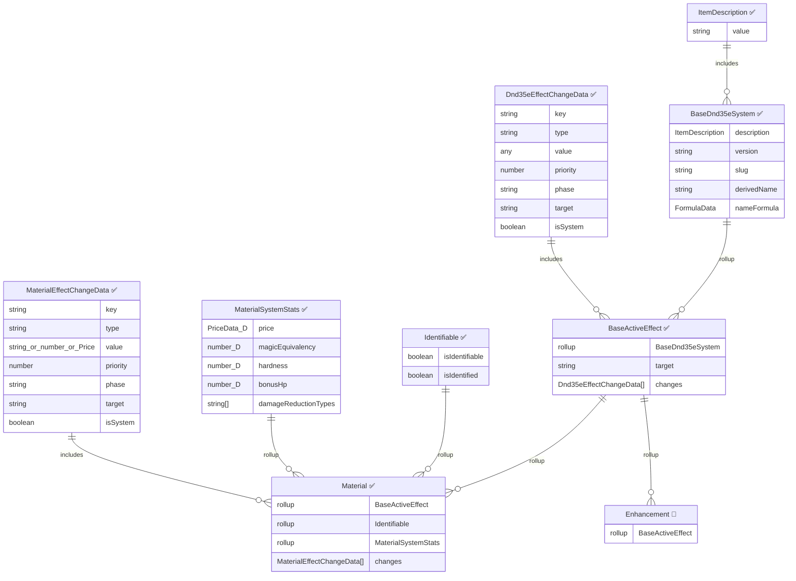

# 📘 Active Effect Architecture Reference (Work in Progress)

A unified reference for all active effect components, compositions, and concrete effect types in the system.

> **Legend**: ✅ = Implemented &nbsp;|&nbsp; 🔲 = Planned (not yet in codebase)
>
> Fields wrapped with `Dnd35eField` are marked with `🔷` — they store data as `{ value, unidentifiedValue, overrides }`, not scalars.
>
> **Note**: Material was migrated from an Item type to an Active Effect type.



## Effect Type Registry

| Type | Document Class | System Model | Sheet | Status |
|------|---------------|-------------|-------|--------|
| `base` | `ActiveEffect` (Foundry) | — | — | ✅ Built-in |
| `material` | `Material` | `MaterialSystemModel` | `MaterialSheet` | ✅ Implemented |
| `enhancement` | — | — | — | 🔲 Planned |

## Composition Chain

```
Foundry ActiveEffect
  └─ DnD35eActiveEffect (base class, custom transfer/hasItemChanges)
       └─ Dnd35eDocumentMixin (doc-level helpers)
            └─ IdentifiableDocumentMixin (isIdentifiable/isIdentified)
                 └─ Material (transfer=false, isTemporary=false)
```

## Change Target System

Each `Dnd35eEffectChangeData` has a `target` field that determines where the change applies:

| Target | Description |
|--------|-------------|
| `item` | Change applies to the parent item's system data |
| `actor` | Change transfers to and applies on the owning actor |

- `DnD35eActiveEffect.transfer` is computed: `true` if any change targets `actor`
- `Material.transfer` is overridden to always `false` (materials only modify items)

## System-Generated Changes (Material)

`MaterialSystemModel.buildChanges()` auto-generates effect changes from the material's stats fields. These are marked with `isSystem: true` and rebuilt in `prepareDerivedData()`. User-added changes (`isSystem: false`) are preserved alongside them.

| Stat Field | Change Key | Change Type | Target |
|-----------|-----------|-------------|--------|
| `price` | `system.price` | `add` | `item` |
| `magicEquivalency` | `system.magicEquivalency` | `upgrade` | `item` |
| `hardness` | `system.hardness` | `add` | `item` |
| `bonusHp` | `system.hp.max` | `add` | `item` |
| `damageReductionTypes` (each) | `system.damageReductionTypes` | `add` | `item` |
