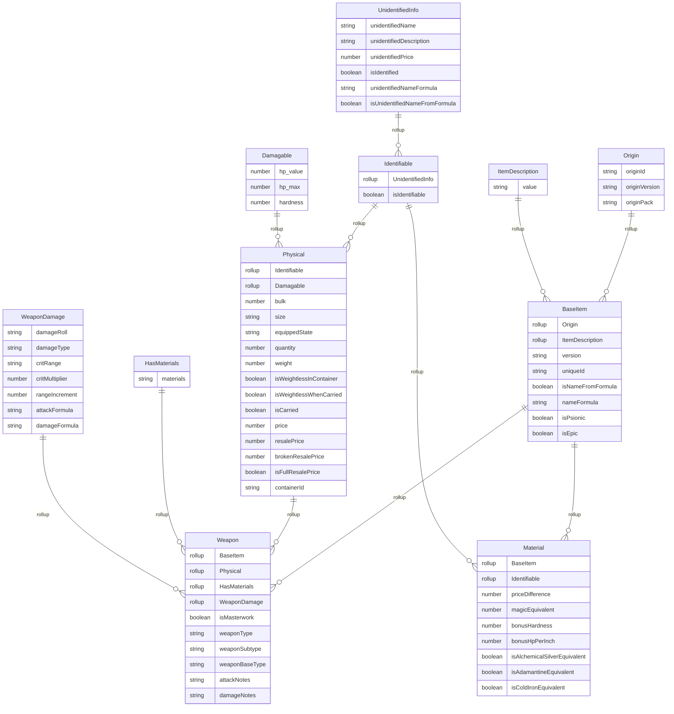

# 📘 Item Architecture Reference (Work in Progress)

A unified reference for all item components, roll‑ups, and concrete item compositions in your system.

```mermaid
erDiagram

    BaseItem {
        rollup Origin
        rollup ItemDescription

        string version
        string uniqueId

        boolean isNameFromFormula
        string nameFormula

        boolean isPsionic
        boolean isEpic
    }

    Origin {
        string originId
        string originVersion
        string originPack
    }

    ItemDescription {
        string value
    }

    Identifiable {
        rollup UnidentifiedInfo

        boolean isIdentifiable
    }

    UnidentifiedInfo {
        string unidentifiedName
        string unidentifiedDescription
        number unidentifiedPrice
        boolean isIdentified
        string unidentifiedNameFormula
        boolean isUnidentifiedNameFromFormula
    }

    HasMaterials {
        string materials
    }

    Damagable {
        number hp_value
        number hp_max
        number hardness
    }

    Physical {
        rollup Identifiable
        rollup Damagable

        number bulk
        string size
        string equippedState

        number quantity
        number weight
        boolean isWeightlessInContainer
        boolean isWeightlessWhenCarried
        boolean isCarried
        number price
        number resalePrice
        number brokenResalePrice
        boolean isFullResalePrice
        string containerId
    }

    Material {
        rollup BaseItem
        rollup Identifiable

        number priceDifference
        number magicEquivalent
        number bonusHardness
        number bonusHpPerInch
        boolean isAlchemicalSilverEquivalent
        boolean isAdamantineEquivalent
        boolean isColdIronEquivalent
    }

    WeaponDamage {
        string damageRoll
        string damageType
        string critRange
        number critMultiplier
        number rangeIncrement
        string attackFormula
        string damageFormula
    }

    Weapon {
        rollup BaseItem
        rollup Physical
        rollup HasMaterials
        rollup WeaponDamage

        boolean isMasterwork
        string weaponType
        string weaponSubtype
        string weaponBaseType
        string attackNotes
        string damageNotes
    }

    %% Composition relationships
    Origin          ||--o{ BaseItem   : "rollup"
    ItemDescription ||--o{ BaseItem   : "rollup"

    UnidentifiedInfo||--o{ Identifiable : "rollup"

    Identifiable    ||--o{ Physical   : "rollup"
    Damagable       ||--o{ Physical   : "rollup"

    BaseItem        ||--o{ Weapon     : "rollup"
    Physical        ||--o{ Weapon     : "rollup"
    HasMaterials    ||--o{ Weapon     : "rollup"
    WeaponDamage    ||--o{ Weapon     : "rollup"

    BaseItem        ||--o{ Material   : "rollup"
    Identifiable    ||--o{ Material   : "rollup"
```
