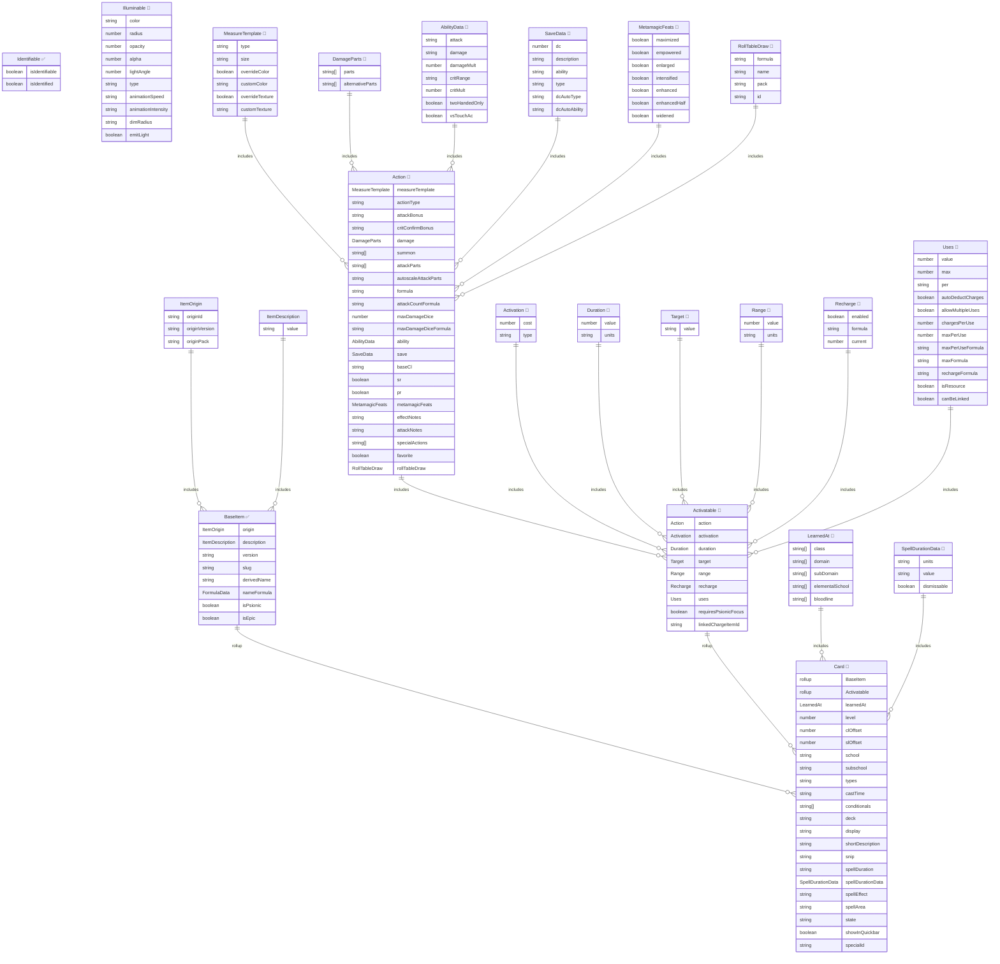

# 📘 Card Item Architecture Reference (Work in Progress)

Cards — deck-based abilities used by card-casting classes.

> **Legend**: ✅ = Implemented &nbsp;|&nbsp; 🔲 = Planned (not yet in codebase)
>
> Fields wrapped with `Dnd35eField` are marked with `🔷` — they store data as `{ value, unidentifiedValue, overrides }`, not scalars.

