# 📘 Physical Item Architecture Reference (Work in Progress)

Items that exist as tangible objects — weapons, armor, gear, consumables, containers.

> **Legend**: ✅ = Implemented &nbsp;|&nbsp; 🔲 = Planned (not yet in codebase)
>
> Fields wrapped with `Dnd35eField` are marked with `🔷` — they store data as `{ value, unidentifiedValue, overrides }`, not scalars.

```mermaid
erDiagram

    ItemOrigin {
        string originId
        string originVersion
        string originPack
    }

    ItemDescription {
        string value
    }

    BaseItem["BaseItem ✅"] {
        ItemOrigin origin
        ItemDescription description

        string version
        string slug
        string derivedName
        FormulaData nameFormula

        boolean isPsionic
        boolean isEpic
    }
    ItemOrigin  ||--o{ BaseItem   : "includes"
    ItemDescription ||--o{ BaseItem   : "includes"

    Identifiable["Identifiable ✅"] {
        boolean isIdentifiable
        boolean isIdentified
    }

    HP["HP ✅"] {
        number_D value
        number_D max
    }

    Cursable["Cursable 🔲"] {
        boolean isCursed
        boolean isCurseActive
    }

    Illuminable["Illuminable 🔲"] {
        string color
        number radius
        number opacity
        number alpha
        number lightAngle
        string type
        string animationSpeed
        string animationIntensity
        string dimRadius
        boolean emitLight
    }

    Activation["Activation 🔲"] {
        number cost
        string type
    }

    Duration["Duration 🔲"] {
        number value
        string units
    }

    Target["Target 🔲"] {
        string value
    }

    Range["Range 🔲"] {
        number value
        string units
    }

    Recharge["Recharge 🔲"] {
        boolean enabled
        string formula
        number current
    }

    Uses["Uses 🔲"] {
        number value
        number max
        string per
        boolean autoDeductCharges
        boolean allowMultipleUses
        number chargesPerUse
        number maxPerUse
        string maxPerUseFormula
        string maxFormula
        string rechargeFormula
        boolean isResource
        boolean canBeLinked
    }

    MeasureTemplate["MeasureTemplate 🔲"] {
        string type
        string size
        boolean overrideColor
        string customColor
        boolean overrideTexture
        string customTexture
    }

    DamageParts["DamageParts 🔲"] {
        string[] parts
        string[] alternativeParts
    }

    AbilityData["AbilityData 🔲"] {
        string attack
        string damage
        number damageMult
        string critRange
        number critMult
        boolean twoHandedOnly
        boolean vsTouchAc
    }

    SaveData["SaveData 🔲"] {
        number dc
        string description
        string ability
        string type
        string dcAutoType
        string dcAutoAbility
    }

    MetamagicFeats["MetamagicFeats 🔲"] {
        boolean maximized
        boolean empowered
        boolean enlarged
        boolean intensified
        boolean enhanced
        boolean enhancedHalf
        boolean widened
    }

    RollTableDraw["RollTableDraw 🔲"] {
        string formula
        string name
        string pack
        string id
    }

    Action["Action 🔲"] {
        MeasureTemplate measureTemplate
        string actionType
        string attackBonus
        string critConfirmBonus
        DamageParts damage
        string[] summon
        string[] attackParts
        string autoscaleAttackParts
        string formula
        string attackCountFormula
        number maxDamageDice
        string maxDamageDiceFormula
        AbilityData ability
        SaveData save
        string baseCl
        boolean sr
        boolean pr
        MetamagicFeats metamagicFeats
        string effectNotes
        string attackNotes
        string[] specialActions
        boolean favorite
        RollTableDraw rollTableDraw
    }
    MeasureTemplate ||--o{ Action : "includes"
    DamageParts     ||--o{ Action : "includes"
    AbilityData     ||--o{ Action : "includes"
    SaveData        ||--o{ Action : "includes"
    MetamagicFeats  ||--o{ Action : "includes"
    RollTableDraw   ||--o{ Action : "includes"

    Activatable["Activatable 🔲"] {
        Action action
        Activation activation
        Duration duration
        Target target
        Range range
        Recharge recharge
        Uses uses
        boolean requiresPsionicFocus
        string linkedChargeItemId
    }
    Action           ||--o{ Activatable : "includes"
    Activation       ||--o{ Activatable : "includes"
    Duration         ||--o{ Activatable : "includes"
    Target           ||--o{ Activatable : "includes"
    Range            ||--o{ Activatable : "includes"
    Recharge         ||--o{ Activatable : "includes"
    Uses             ||--o{ Activatable : "includes"

    Physical["Physical ✅"] {
        rollup Identifiable
        rollup Cursable
        rollup Illuminable
        rollup Activatable

        HP hp
        number_D hardness
        number_D quantity
        number_D weight
        boolean isCarried
        Size_D size
        PriceData_D price
        PriceData resalePrice
        PriceData brokenResalePrice
        boolean isBroken
        string containerId
        %% Derived
        number effectiveWeight
        number magicEquivalency
        string[] damageReductionTypes
    }
    Identifiable    ||--o{ Physical   : "rollup"
    Cursable        ||--o{ Physical   : "rollup"
    Illuminable     ||--o{ Physical   : "rollup"
    Activatable     ||--o{ Physical   : "rollup"
    HP              ||--o{ Physical   : "includes"

    Enhancable["Enhancable 🔲"] {
        EnhancementData[] enhancements
    }

    Equippable["Equippable ✅"] {
        rollup Physical
        rollup Enhancable

        boolean isEquipped
        EquipSlot[] equippedSlotIds
        boolean isMelded
        Size_D designedForSize
        boolean isWeightlessWhenEquipped
    }
    Physical        ||--o{ Equippable   : "rollup"
    Enhancable      ||--o{ Equippable   : "rollup"

    Equipment["Equipment 🔲"] {
        rollup BaseItem
        rollup Equippable
    }
    BaseItem        ||--o{ Equipment   : "rollup"
    Equippable      ||--o{ Equipment   : "rollup"

    ArmorStats["ArmorStats 🔲"] {
        number ac
        number dexModifierCap
        number armorCheckPenalty
        number arcaneSpellFailurePenalty
        boolean isMasterworkArmor
    }

    Armor["Armor 🔲"] {
        rollup BaseItem
        rollup Equippable
        rollup ArmorStats
    }
    BaseItem        ||--o{ Armor   : "rollup"
    Equippable      ||--o{ Armor   : "rollup"
    ArmorStats      ||--o{ Armor   : "rollup"

    WeaponDamage["WeaponDamage ✅"] {
        string_D damageRoll
        string_D damageType
        string_D critRange
        number_D critMultiplier
        number_D rangeIncrement
        string attackFormula
        string damageFormula
    }

    Weapon["Weapon ✅"] {
        rollup BaseItem
        rollup Equippable

        boolean isMasterwork
        WeaponType_D weaponType
        WeaponSubtype_D weaponSubtype
        WeaponBaseType_D weaponBaseType
        WeaponDamage weaponDamage
        string attackNotes
        string damageNotes
    }
    BaseItem        ||--o{ Weapon   : "rollup"
    Equippable      ||--o{ Weapon   : "rollup"
    WeaponDamage    ||--o{ Weapon   : "includes"

    Shield["Shield 🔲"] {
        rollup BaseItem
        rollup Equippable
        rollup ArmorStats

        boolean isMasterwork
        WeaponType_D weaponType
        WeaponSubtype_D weaponSubtype
        WeaponBaseType_D weaponBaseType
        WeaponDamage weaponDamage
        string attackNotes
        string damageNotes
    }
    BaseItem        ||--o{ Shield   : "rollup"
    Equippable      ||--o{ Shield   : "rollup"
    WeaponDamage    ||--o{ Shield   : "includes"
    ArmorStats      ||--o{ Shield   : "rollup"

    ConsumableUses["ConsumableUses 🔲"] {
        number value
        number max
        string maxFormula
        string per
    }

    Consumable["Consumable 🔲"] {
        rollup BaseItem
        rollup Physical

        ConsumableUses uses
        string consumableType
        boolean isFromSpell
        string scrollType
    }
    BaseItem        ||--o{ Consumable   : "rollup"
    Physical        ||--o{ Consumable   : "rollup"
    ConsumableUses            ||--o{ Consumable   : "includes"

    BonusAmmo["BonusAmmo 🔲"] {
        string attack
        string enhancement
        string damage
        string damageType
        string damageUid
        string attackNote
    }

    Loot["Loot 🔲"] {
        rollup BaseItem
        rollup Physical

        string subType
        BonusAmmo bonusAmmo
        boolean bagOfHoldingLike
        boolean containerCanUseItems
        number capacity
    }
    BaseItem     ||--o{ Loot : "rollup"
    Physical     ||--o{ Loot : "rollup"
    BonusAmmo ||--o{ Loot : "includes"
```

